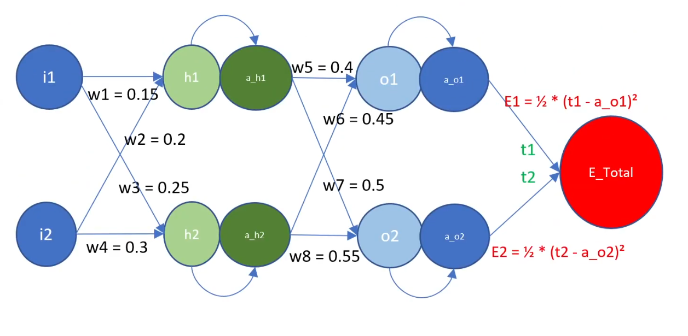

# Part 1

## Network



The above image shows a network with the following inputs.

```
η = Learning rate
t1 = output1 (Expected output for Input 1)
t2 = output2 (Expected output for Input 2)
i1 = Input 1
i2 = Input 2
```

Based on the above, we calculate the following parameters. Every parameter except the weights is initially undefined. Weights are chosen randomly here. Other parameters and weights for future iterations are derived from other parameters and input.

```
w1 = weight 1
w2 = weight 2
w3 = weight 3
w4 = weight 4
w5 = weight 5
w6 = weight 6
w7 = weight 7
w8 = weight 8

h1 = w1*i1 + w2*i2
h2 = w3*i1 + w4*i2

a_h1 = sigma(h1) = 1/(1 + exp(-h1))
a_h2 = sigma(h2) = 1/(1 + exp(-h2))

o1 = w5*a_h1 + w6*a_h2
o2 = w7*a_h1 + w8*a_h2

a_o1 = sigma(o1) = 1/(1 + exp(-o1))
a_o2 = sigma(o2) = 1/(1 + exp(-o2))

E1 = (1/2)*(t1 - a_o1)^2
E2 = (1/2)*(t2 - a_o2)^2

E_Total = E1 + E2 = E
```

Now to update weights, we need the partial differential of `E` with respect to those weights.

In short, we need the following:

```
∂E/∂w1 = ?
∂E/∂w2 = ?
∂E/∂w3 = ?
∂E/∂w4 = ?
∂E/∂w5 = ?
∂E/∂w6 = ?
∂E/∂w7 = ?
∂E/∂w8 = ?
```

Let us start from the right to left (backward) direction.

```
∂E/∂w5 = ∂(E1 + E1)/∂w5 = ∂E1/∂w5           [as E2 does not depend on w5]
∂E/∂w6 = ∂(E1 + E1)/∂w6 = ∂E1/∂w6           [as E2 does not depend on w6]
∂E/∂w7 = ∂(E1 + E1)/∂w7 = ∂E2/∂w7           [as E1 does not depend on w7]
∂E/∂w8 = ∂(E1 + E1)/∂w8 = ∂E2/∂w8           [as E1 does not depend on w8]
```

We can derive the above by chaining the differentials like:

```
∂E/∂w5 = ∂E1/∂w5 = ∂E1/∂a_o1 * ∂a_o1/∂o1 * ∂o1/∂w5               (i)
∂E/∂w6 = ∂E1/∂w6 = ∂E1/∂a_o1 * ∂a_o1/∂o1 * ∂o1/∂w6               (ii)
∂E/∂w7 = ∂E2/∂w7 = ∂E2/∂a_o2 * ∂a_o2/∂o2 * ∂o2/∂w7               (iii)
∂E/∂w8 = ∂E2/∂w8 = ∂E2/∂a_o2 * ∂a_o2/∂o2 * ∂o2/∂w8               (iv)
```

To derive `(i)`, we calculate the 3 terms in it:

```
∂E1/∂a_o1 = ∂((1/2)*(t1 - a_o1)^2)/∂a_o1 = a_o1 - t1

∂a_o1/∂o1 = ∂(sigma(o1))/∂o1 = sigma(o1) * (1 - sigma(o1)) = a_o1 * (1 - a_o1)

∂o1/∂w5 = ∂(w5*a_h1 + w6*a_h2)/∂w5 = a_h1
```

Plugging the above in `(i)`, we get:

```
∂E/∂w5 = (a_o1 - t1) * (a_o1 * (1 - a_o1)) * a_h1
```

Similarly, to derive `(ii)`, we calculate the 3 terms in it:

```
∂E1/∂a_o1 = ∂((1/2)*(t1 - a_o1)^2)/∂a_o1 = a_o1 - t1

∂a_o1/∂o1 = ∂(sigma(o1))/∂o1 = sigma(o1) * (1 - sigma(o1)) = a_o1 * (1 - a_o1)

∂o1/∂w6 = ∂(w5*a_h1 + w6*a_h2)/∂w6 = a_h2
```

Plugging the above in `(ii)`, we get:

```
∂E/∂w6 = (a_o1 - t1) * (a_o1 * (1 - a_o1)) * a_h2
```

Similarly, to derive `(iii)`, we calculate the 3 terms in it:

```
∂E2/∂a_o2 = ∂((1/2)*(t2 - a_o2)^2)/∂a_o1 = a_o2 - t2

∂a_o2/∂o2 = ∂(sigma(o2))/∂o2 = sigma(o2) * (1 - sigma(o2)) = a_o2 * (1 - a_o2)

∂o2/∂w7 = ∂(w7*a_h1 + w8*a_h2)/∂w7 = a_h1
```

Plugging the above in `(iii)`, we get:

```
∂E/∂w7 = (a_o2 - t2) * (a_o2 * (1 - a_o2)) * a_h1
```

Similarly, to derive `(iv)`, we calculate the 3 terms in it:

```
∂E2/∂a_o2 = ∂((1/2)*(t2 - a_o2)^2)/∂a_o1 = a_o2 - t2

∂a_o2/∂o2 = ∂(sigma(o2))/∂o2 = sigma(o2) * (1 - sigma(o2)) = a_o2 * (1 - a_o2)

∂o2/∂w8 = ∂(w7*a_h1 + w8*a_h2)/∂w8 = a_h2
```

Plugging the above in `(iv)`, we get:

```
∂E/∂w8 = (a_o2 - t2) * (a_o2 * (1 - a_o2)) * a_h2
```

Finally, we have our 4 of the 8 derivatives:

```
∂E/∂w5 = (a_o1 - t1) * (a_o1 * (1 - a_o1)) * a_h1
∂E/∂w6 = (a_o1 - t1) * (a_o1 * (1 - a_o1)) * a_h2
∂E/∂w7 = (a_o2 - t2) * (a_o2 * (1 - a_o2)) * a_h1
∂E/∂w8 = (a_o2 - t2) * (a_o2 * (1 - a_o2)) * a_h2
```

Similarly, we can go ahead and derive the other 4.

```
∂E/∂w1 = ∂(E1 + E2)/∂w1 = ∂E1/∂w1 + ∂E2/∂w1                     (v)
∂E/∂w2 = ∂(E1 + E2)/∂w2 = ∂E1/∂w2 + ∂E2/∂w2                     (vi)
∂E/∂w3 = ∂(E1 + E2)/∂w3 = ∂E1/∂w3 + ∂E2/∂w3                     (vii)
∂E/∂w4 = ∂(E1 + E2)/∂w4 = ∂E1/∂w4 + ∂E2/∂w4                     (viii)
```

To derive the above, we need to find the derivatives of the errors with respect to `a_h1` and `a_h2` because

```
∂E1/∂w1 = ∂E1/∂a_h1 * ∂a_h1/∂h1 * ∂h1/∂w1
∂E2/∂w1 = ∂E2/∂a_h1 * ∂a_h1/∂h1 * ∂h1/∂w1
∂E1/∂w2 = ∂E1/∂a_h1 * ∂a_h1/∂h1 * ∂h1/∂w2
∂E2/∂w2 = ∂E2/∂a_h1 * ∂a_h1/∂h1 * ∂h1/∂w2
∂E1/∂w3 = ∂E1/∂a_h2 * ∂a_h2/∂h2 * ∂h2/∂w3
∂E2/∂w3 = ∂E2/∂a_h2 * ∂a_h2/∂h2 * ∂h2/∂w3
∂E1/∂w4 = ∂E1/∂a_h2 * ∂a_h2/∂h2 * ∂h2/∂w4
∂E2/∂w4 = ∂E2/∂a_h2 * ∂a_h2/∂h2 * ∂h2/∂w4

∂E1/∂a_h1 = ∂E1/∂a_o1 * ∂a_o1/∂o1 * ∂o1/∂a_h1
          = (a_o1 - t1) * (a_o1 * (1 - a_o1)) * w5

∂E2/∂a_h1 = ∂E2/∂a_o2 * ∂a_o2/∂o2 * ∂o2/∂a_h1
          = (a_o2 - t2) * (a_o2 * (1 - a_o2)) * w7

∂E1/∂a_h2 = ∂E1/∂a_o1 * ∂a_o1/∂o1 * ∂o1/∂a_h2
          = (a_o1 - t1) * (a_o1 * (1 - a_o1)) * w6

∂E2/∂a_h2 = ∂E2/∂a_o2 * ∂a_o2/∂o2 * ∂o2/∂a_h2
          = (a_o2 - t2) * (a_o2 * (1 - a_o2)) * w8
```

Using the above equations, we can derive `∂E/∂a_h1` and `∂E/∂a_h2` (simple addition):

```
∂E/∂a_h1 = ∂E1/∂a_ah1 + ∂E2/∂a_h1
         = ((a_o1 - t1) * (a_o1 * (1 - a_o1)) * w5) + ((a_o2 - t2) * (a_o2 * (1 - a_o2)) * w7)

∂E/∂a_h2 = ∂E1/∂a_ah2 + ∂E2/∂a_h2
         = ((a_o1 - t1) * (a_o1 * (1 - a_o1)) * w6) + ((a_o2 - t2) * (a_o2 * (1 - a_o2)) * w8)
```

Now we can finally get the desired derivatives with respect to the weights.

```
∂E/∂w1 = ∂E/∂a_h1 * ∂a_h1/∂h1 * ∂h1/∂w1
       = [((a_o1 - t1) * (a_o1 * (1 - a_o1)) * w5) + ((a_o2 - t2) * (a_o2 * (1 - a_o2)) * w7)] * a_h1 * (1 - a_h1) * i1

∂E/∂w2 = ∂E/∂a_h1 * ∂a_h1/∂h1 * ∂h1/∂w2
       = [((a_o1 - t1) * (a_o1 * (1 - a_o1)) * w5) + ((a_o2 - t2) * (a_o2 * (1 - a_o2)) * w7)] * a_h1 * (1 - a_h1) * i2

∂E/∂w3 = ∂E/∂a_h2 * ∂a_h2/∂h2 * ∂h2/∂w3
       = [((a_o1 - t1) * (a_o1 * (1 - a_o1)) * w6) + ((a_o2 - t2) * (a_o2 * (1 - a_o2)) * w8)] * a_h2 * (1 - a_h2) * i1

∂E/∂w4 = ∂E/∂a_h2 * ∂a_h2/∂h2 * ∂h2/∂w4
       = [((a_o1 - t1) * (a_o1 * (1 - a_o1)) * w6) + ((a_o2 - t2) * (a_o2 * (1 - a_o2)) * w8)] * a_h2 * (1 - a_h2) * i2
```

The final equations of derivative of error with respect to weights are:

```
∂E/∂w1 = [((a_o1 - t1) * (a_o1 * (1 - a_o1)) * w5) + ((a_o2 - t2) * (a_o2 * (1 - a_o2)) * w7)] * a_h1 * (1 - a_h1) * i1

∂E/∂w2 = [((a_o1 - t1) * (a_o1 * (1 - a_o1)) * w5) + ((a_o2 - t2) * (a_o2 * (1 - a_o2)) * w7)] * a_h1 * (1 - a_h1) * i2

∂E/∂w3 = [((a_o1 - t1) * (a_o1 * (1 - a_o1)) * w6) + ((a_o2 - t2) * (a_o2 * (1 - a_o2)) * w8)] * a_h2 * (1 - a_h2) * i1

∂E/∂w4 = [((a_o1 - t1) * (a_o1 * (1 - a_o1)) * w6) + ((a_o2 - t2) * (a_o2 * (1 - a_o2)) * w8)] * a_h2 * (1 - a_h2) * i2

∂E/∂w5 = (a_o1 - t1) * (a_o1 * (1 - a_o1)) * a_h1

∂E/∂w6 = (a_o1 - t1) * (a_o1 * (1 - a_o1)) * a_h2

∂E/∂w7 = (a_o2 - t2) * (a_o2 * (1 - a_o2)) * a_h1

∂E/∂w8 = (a_o2 - t2) * (a_o2 * (1 - a_o2)) * a_h2
```

Now, we know the gradient. All that's left to do is update the individual weights. For this, we multiply learning rate with the gradient with respect to the weight and subtract the result from that weight.

So, new weights would be calculated as:

```
w1 = w1 - η * ∂E/∂w1
w2 = w2 - η * ∂E/∂w2
w3 = w3 - η * ∂E/∂w3
w4 = w4 - η * ∂E/∂w4
w5 = w5 - η * ∂E/∂w5
w6 = w6 - η * ∂E/∂w6
w7 = w7 - η * ∂E/∂w7
w8 = w8 - η * ∂E/∂w8
```

We keep doing this to reduce the total error or loss.

See the screenshot of the spreadsheet using the above formulae (`η = 1`).


## Plots

### η = 0.1


### η = 0.2


### η = 0.5


### η = 0.8


### η = 1.0


### η = 2.0


