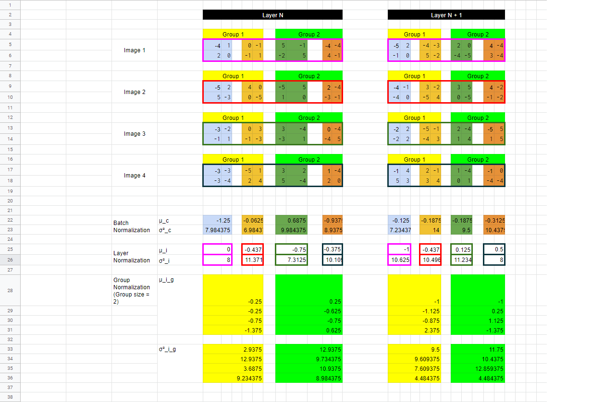
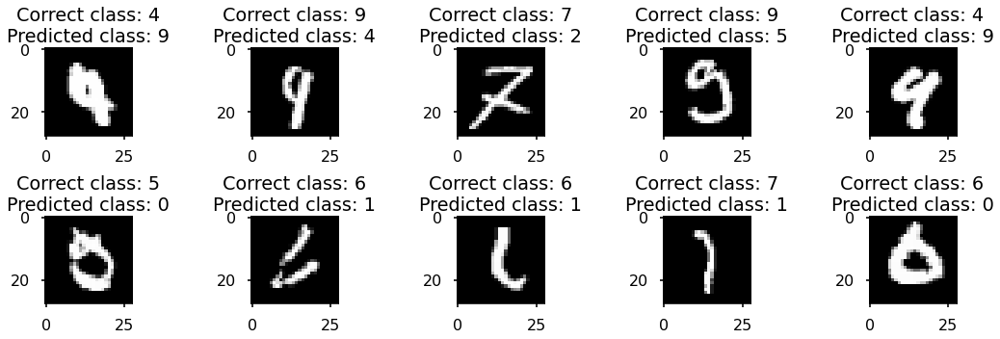
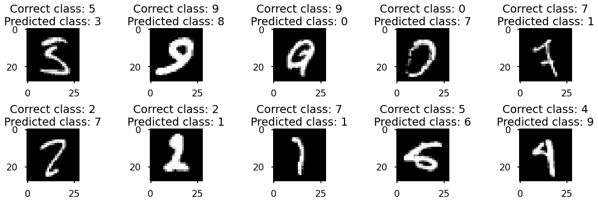
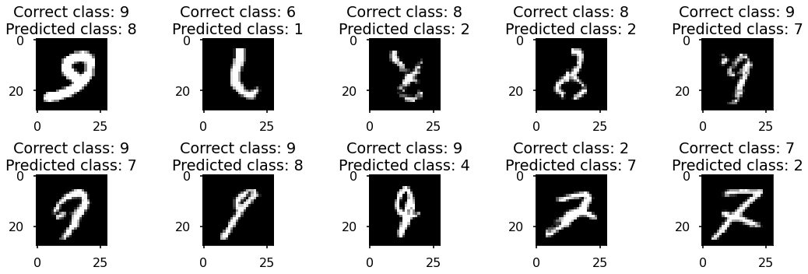
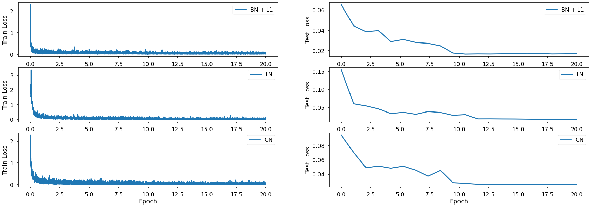
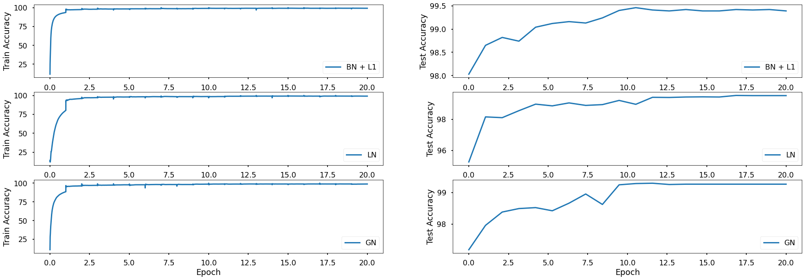

# Objectives

1. You are making 3 versions of your 4th assignment's best model (or pick one from best assignments):

   1. Network with Group Normalization
   2. Network with Layer Normalization
   3. Network with L1 + Batch Normalization

2. You MUST:
   1. Write a single model.py file that includes GN/LN/BN and takes an argument to decide which normalization to include
   2. Write a single notebook file to run all the 3 models above for 20 epochs each
   3. Create these graphs:
      1. Graph 1: Test/Validation Loss for all 3 models together
      2. Graph 2: Test/Validation Accuracy for 3 models together
      3. Graphs must have proper annotation
3. Find 10 misclassified images for each of the 3 models, and show them as a 5x2 image matrix in 3 separately annotated images.
4. Write an explanatory README file that explains:
   1. What is your code all about?
   2. How to perform the 3 normalizations techniques that we covered(cannot use values from the excel sheet shared)
   3. Your findings for normalization techniques
   4. Add all your graphs
   5. Your 3 collection of misclassified images

Upload your complete assignment on GitHub and share the link on LMS

# Code Overview

There's a single `model.py` file which contains the Model. It expects an argument (either of - `BN, LN, GN`).

All the other utility functions are defined in the notebook itself.

I chose the last iteration of my session 4 assignment which achieved the best accuracy with least amount of parameters.

## Transformations

- Random rotation
- Image normalization

## Normalizations

- Batch Normalization
- Group Normalization
- Layer Normalization

## Regularization

- **L1 Regularization:**
  Used Regularization factor of `1.0e-5`. Used only with **Batch Normalization**.

<hr>

### These are the model parameters:

```
==============================================================================================================================================================================================
Layer (type (var_name))                  Kernel Shape              Input Shape               Output Shape              Param #                   Mult-Adds                 Trainable
==============================================================================================================================================================================================
Net (Net)                                --                        [20, 1, 28, 28]           [20, 10]                  --                        --                        True
├─Sequential (conv0)                     --                        [20, 1, 28, 28]           [20, 10, 26, 26]          --                        --                        True
│    └─Conv2d (0)                        [3, 3]                    [20, 1, 28, 28]           [20, 10, 26, 26]          90                        1,216,800                 True
│    └─ReLU (1)                          --                        [20, 10, 26, 26]          [20, 10, 26, 26]          --                        --                        --
│    └─BatchNorm2d (2)                   --                        [20, 10, 26, 26]          [20, 10, 26, 26]          20                        400                       True
│    └─Dropout (3)                       --                        [20, 10, 26, 26]          [20, 10, 26, 26]          --                        --                        --
├─Sequential (conv1)                     --                        [20, 10, 26, 26]          [20, 20, 24, 24]          --                        --                        True
│    └─Conv2d (0)                        [3, 3]                    [20, 10, 26, 26]          [20, 20, 24, 24]          1,800                     20,736,000                True
│    └─ReLU (1)                          --                        [20, 20, 24, 24]          [20, 20, 24, 24]          --                        --                        --
│    └─BatchNorm2d (2)                   --                        [20, 20, 24, 24]          [20, 20, 24, 24]          40                        800                       True
│    └─Dropout (3)                       --                        [20, 20, 24, 24]          [20, 20, 24, 24]          --                        --                        --
├─Sequential (trans1)                    --                        [20, 20, 24, 24]          [20, 10, 12, 12]          --                        --                        True
│    └─Conv2d (0)                        [1, 1]                    [20, 20, 24, 24]          [20, 10, 24, 24]          200                       2,304,000                 True
│    └─MaxPool2d (1)                     2                         [20, 10, 24, 24]          [20, 10, 12, 12]          --                        --                        --
├─Sequential (conv2)                     --                        [20, 10, 12, 12]          [20, 20, 10, 10]          --                        --                        True
│    └─Conv2d (0)                        [3, 3]                    [20, 10, 12, 12]          [20, 20, 10, 10]          1,800                     3,600,000                 True
│    └─ReLU (1)                          --                        [20, 20, 10, 10]          [20, 20, 10, 10]          --                        --                        --
│    └─BatchNorm2d (2)                   --                        [20, 20, 10, 10]          [20, 20, 10, 10]          40                        800                       True
│    └─Dropout (3)                       --                        [20, 20, 10, 10]          [20, 20, 10, 10]          --                        --                        --
├─Sequential (conv3)                     --                        [20, 20, 10, 10]          [20, 10, 8, 8]            --                        --                        True
│    └─Conv2d (0)                        [3, 3]                    [20, 20, 10, 10]          [20, 10, 8, 8]            1,800                     2,304,000                 True
│    └─ReLU (1)                          --                        [20, 10, 8, 8]            [20, 10, 8, 8]            --                        --                        --
│    └─BatchNorm2d (2)                   --                        [20, 10, 8, 8]            [20, 10, 8, 8]            20                        400                       True
│    └─Dropout (3)                       --                        [20, 10, 8, 8]            [20, 10, 8, 8]            --                        --                        --
├─Sequential (conv4)                     --                        [20, 10, 8, 8]            [20, 10, 6, 6]            --                        --                        True
│    └─Conv2d (0)                        [3, 3]                    [20, 10, 8, 8]            [20, 10, 6, 6]            900                       648,000                   True
│    └─ReLU (1)                          --                        [20, 10, 6, 6]            [20, 10, 6, 6]            --                        --                        --
│    └─BatchNorm2d (2)                   --                        [20, 10, 6, 6]            [20, 10, 6, 6]            20                        400                       True
│    └─Dropout (3)                       --                        [20, 10, 6, 6]            [20, 10, 6, 6]            --                        --                        --
├─Sequential (conv5)                     --                        [20, 10, 6, 6]            [20, 10, 6, 6]            --                        --                        True
│    └─Conv2d (0)                        [3, 3]                    [20, 10, 6, 6]            [20, 10, 6, 6]            900                       648,000                   True
│    └─ReLU (1)                          --                        [20, 10, 6, 6]            [20, 10, 6, 6]            --                        --                        --
│    └─BatchNorm2d (2)                   --                        [20, 10, 6, 6]            [20, 10, 6, 6]            20                        400                       True
│    └─Dropout (3)                       --                        [20, 10, 6, 6]            [20, 10, 6, 6]            --                        --                        --
├─Sequential (gap)                       --                        [20, 10, 6, 6]            [20, 10, 1, 1]            --                        --                        --
│    └─AvgPool2d (0)                     6                         [20, 10, 6, 6]            [20, 10, 1, 1]            --                        --                        --
├─Sequential (conv6)                     --                        [20, 10, 1, 1]            [20, 10, 1, 1]            --                        --                        True
│    └─Conv2d (0)                        [1, 1]                    [20, 10, 1, 1]            [20, 10, 1, 1]            100                       2,000                     True
==============================================================================================================================================================================================
Total params: 7,750
Trainable params: 7,750
Non-trainable params: 0
Total mult-adds (M): 31.46
==============================================================================================================================================================================================
Input size (MB): 0.06
Forward/backward pass size (MB): 7.85
Params size (MB): 0.03
Estimated Total Size (MB): 7.94
==============================================================================================================================================================================================
```

# Normalizations

## 1. Batch Normalization (BN)

To perform BN, we calculate the mean and the variance of each channel. It does not depend on the mini-batch size. No matter how many images are in the batch, there is only 1 mean and 1 variance for each channel. The number of additional parameters depends on the number of channels.

## 2. Layer Normalization (LN)

To perform LN, we calculate the mean and the variance of each image in the mini-batch across all the channels. No matter how many channels are there, there is only 1 mean and 1 variance for each image. The number of additional parameters depends on the size of the mini-batch.

## 3. Group Normalization (GN)

To perform GN, we calculate the mean and the variance of each group. The grouping is of the channels. Mean and variance are calculated for each image in the mini-batch. The number of additional parameters depends on the size of the mini-batch and the number of groups.

If the size of batch is 4 and number of groups is 2 then the number of additional parameters added is 8 each for mean and variance.

# Normalization Calculations

Refer to `normalization_calculations.xlsx`



## Results:

- ## Batch Normalization + L1 Regularization

  - Total Parameters = 7,750
  - Minimum training loss = 0.022673793%
  - Minimum testing loss = 0.016716760%
  - Best training accuracy = 99.26%
  - Best testing accuracy = 99.46%
  - Misclassified images
    

- ## Layer Normalization (Batch size = 128)

  - Total Parameters = 7,750
  - Minimum training loss = 0.000677945%
  - Minimum testing loss = 0.016774649%
  - Best training accuracy = 99.17%
  - Best testing accuracy = 99.53%
  - Misclassified images
    

- ## Group Normalization (Group size = 5)
  - Total Parameters = 7,750
  - Minimum training loss = 0.000926618%
  - Minimum testing loss = 0.025614110%
  - Best training accuracy = 99.02%
  - Best testing accuracy = 99.29%
  - Misclassified images
    

# Analysis

- Highest training accuracy in Batch Normalization + L1 regularization
- Highest testing accuracy in Layer Normalization
- Least difference between train and test accuracies was achieved with Batch Normalization with L1 Regularization

# Graphs

## Loss



## Accuracies



# Link to Colab

[Solution](https://colab.research.google.com/drive/1x2HkXg2A3xmXst7MH3kMuqi1oGOSkO3x?usp=sharing)

Or you can check out the file: `session5_assignment.ipynb`
<br>

<hr>
