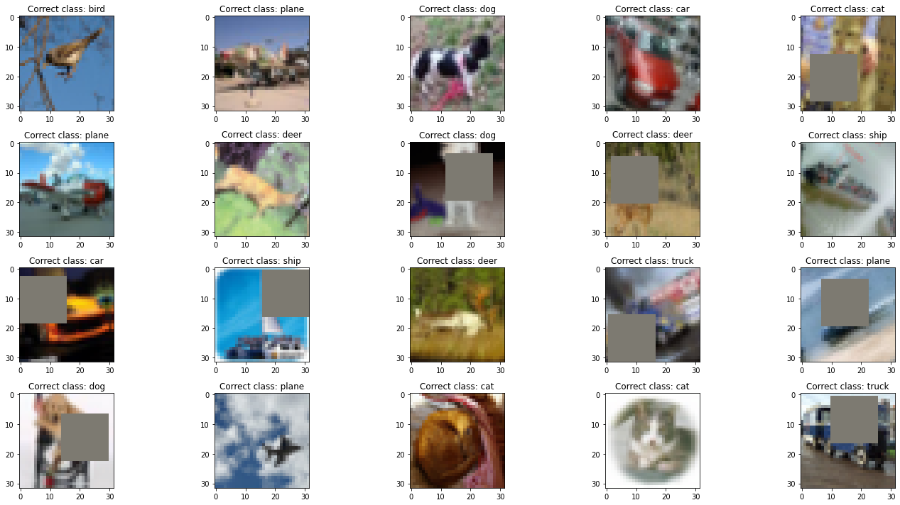
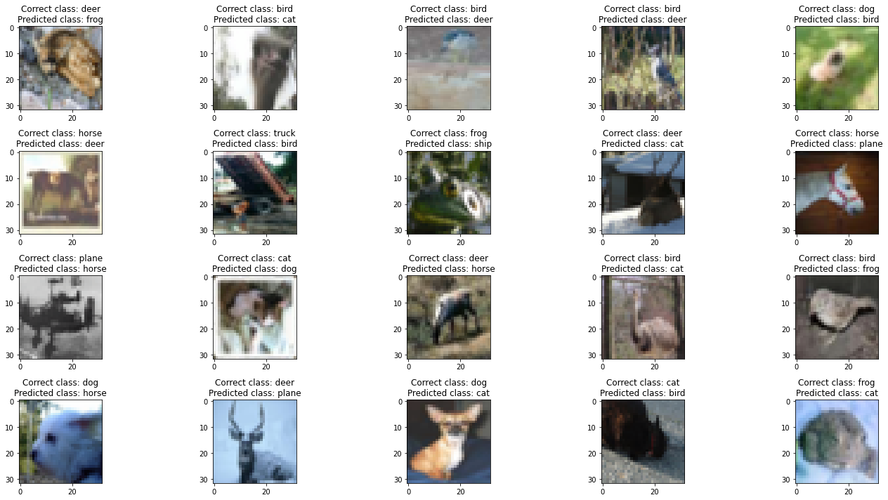
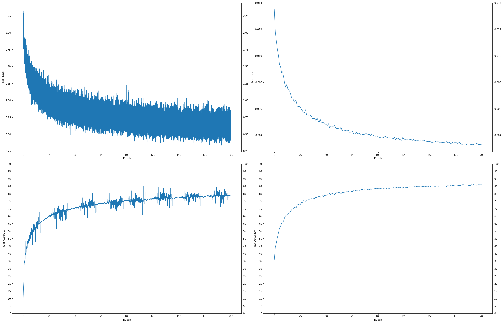

# **Assignment 6**

---

1. Run this [network](https://colab.research.google.com/drive/1qlewMtxcAJT6fIJdmMh8pSf2e-dh51Rw)
2. Fix the network above:

   1. change the code such that it uses GPU and
   2. change the architecture to `C1|C2|C3|C4|O` (_No MaxPooling, but 3 3x3 layers with stride of 2 instead) (If you can figure out how to use Dilated kernels here instead of MP or strided convolution, then `200pts extra!`_)
   3. total RF must be more than `44`
   4. one of the layers must use Depthwise Separable Convolution
   5. one of the layers must use Dilated Convolution
   6. use GAP (_compulsory_) :- add FC after GAP to target # of classes (_optional_)
   7. use albumentation library and apply:

      - horizontal flip
      - shiftScaleRotate
      - coarseDropout (`max_holes = 1, max_height=16, min_width=16, min_holes = 1, min_height=16, max_width=16, fill_value=(mean of your dataset), mask_fill_value = None`)

   8. achieve `85% accuracy`, as many epochs as you want.
   9. Total Params to be less than `200k`.

3. Upload to Github
4. Attempt S6-Assignment Solution.
5. Questions in the Assignment QnA are:
   1. copy paste your model code from your model.py file (full code) `[125]`
   2. copy paste output of torchsummary `[125]`
   3. copy-paste the code where you implemented albumentation transformation for all three transformations `[125]`
   4. copy paste your training log (you must be running validation/text after each Epoch `[125]`
   5. Share the link for your README.md file. `[200]`

---

# **Colab Link**

## [**Solution on Colab**](https://colab.research.google.com/drive/1UdvIPAicwzppjDnQBu5-SJ5iIbnbJEoP?usp=sharing)

Or, check out the committed notebook file - `session6_assignment.ipynb`

<br>

# **Key Points**

- The model is composed of 4 blocks followed by a GAP layer.
- Instead of Maxpooling or a 3x3 Strided convolution, I have used a Dilated + Strided convolution Blocks 2, 3 and 4
- I have used Depthwise Separable Convolution in Blocks 2 and 4
- I have used Dilated Convolution (Stride = 1) in Block 3
- Output RF = `101`

<hr>
<br>

# **RF Calculations**

| **Input Size** | **Input RF** | **Kernel (+Dilation)** | **Padding** | **Stride** | **Jump In** | **Jump Out** | **Output RF** | **Output Size** | **Block** | **Notes**                          |
| -------------- | ------------ | ---------------------- | ----------- | ---------- | ----------- | ------------ | ------------- | --------------- | --------- | ---------------------------------- |
| 32             | 1            | 5                      | 2           | 1          | 1           | 1            | 5             | 32              | 1         | Normal Conv                        |
| 32             | 5            | 3                      | 1           | 1          | 1           | 1            | 7             | 32              | 1         | Normal Conv                        |
| 32             | 7            | 3                      | 1           | 1          | 1           | 1            | 9             | 32              | 1         | Normal Conv                        |
| 32             | 9            | 5                      | 2           | 2          | 1           | 2            | 13            | 16              | 2         | Dilated + Strided Conv             |
| 16             | 13           | 3                      | 1           | 1          | 2           | 2            | 17            | 16              | 2         | Depthwise Separable Conv           |
| 16             | 17           | 3                      | 1           | 1          | 2           | 2            | 21            | 16              | 2         | Depthwise Separable Conv           |
| 16             | 21           | 5                      | 2           | 2          | 2           | 4            | 29            | 8               | 3         | Dilated + Strided Conv             |
| 8              | 29           | 5                      | 1           | 1          | 4           | 4            | 45            | 8               | 3         | Dilated Conv                       |
| 8              | 45           | 3                      | 1           | 1          | 4           | 4            | 53            | 8               | 3         | Normal Conv                        |
| 8              | 53           | 5                      | 2           | 2          | 4           | 8            | 69            | 4               | 4         | Dilated + Strided Conv             |
| 4              | 69           | 3                      | 1           | 1          | 8           | 8            | 85            | 4               | 4         | Depthwise Separable Conv           |
| 4              | 85           | 3                      | 1           | 1          | 8           | 8            | 101           | 4               | 4         | Normal Conv (Last conv before GAP) |

<hr>
<br>

# **Model Parameters**

```
==============================================================================================================================================================================================
Layer (type (var_name))                  Kernel Shape              Input Shape               Output Shape              Param #                   Mult-Adds                 Trainable
==============================================================================================================================================================================================
Net (Net)                                --                        [20, 3, 32, 32]           [20, 10]                  --                        --                        True
├─Sequential (conv_block1)               --                        [20, 3, 32, 32]           [20, 32, 32, 32]          --                        --                        True
│    └─Conv2d (0)                        [5, 5]                    [20, 3, 32, 32]           [20, 128, 32, 32]         9,600                     196,608,000               True
│    └─ReLU (1)                          --                        [20, 128, 32, 32]         [20, 128, 32, 32]         --                        --                        --
│    └─BatchNorm2d (2)                   --                        [20, 128, 32, 32]         [20, 128, 32, 32]         256                       5,120                     True
│    └─Dropout (3)                       --                        [20, 128, 32, 32]         [20, 128, 32, 32]         --                        --                        --
│    └─Conv2d (4)                        [3, 3]                    [20, 128, 32, 32]         [20, 64, 32, 32]          73,728                    1,509,949,440             True
│    └─ReLU (5)                          --                        [20, 64, 32, 32]          [20, 64, 32, 32]          --                        --                        --
│    └─BatchNorm2d (6)                   --                        [20, 64, 32, 32]          [20, 64, 32, 32]          128                       2,560                     True
│    └─Dropout (7)                       --                        [20, 64, 32, 32]          [20, 64, 32, 32]          --                        --                        --
│    └─Conv2d (8)                        [3, 3]                    [20, 64, 32, 32]          [20, 32, 32, 32]          18,432                    377,487,360               True
│    └─ReLU (9)                          --                        [20, 32, 32, 32]          [20, 32, 32, 32]          --                        --                        --
│    └─BatchNorm2d (10)                  --                        [20, 32, 32, 32]          [20, 32, 32, 32]          64                        1,280                     True
│    └─Dropout (11)                      --                        [20, 32, 32, 32]          [20, 32, 32, 32]          --                        --                        --
├─Sequential (conv_block2)               --                        [20, 32, 32, 32]          [20, 32, 16, 16]          --                        --                        True
│    └─Conv2d (0)                        [3, 3]                    [20, 32, 32, 32]          [20, 32, 16, 16]          9,216                     47,185,920                True
│    └─ReLU (1)                          --                        [20, 32, 16, 16]          [20, 32, 16, 16]          --                        --                        --
│    └─BatchNorm2d (2)                   --                        [20, 32, 16, 16]          [20, 32, 16, 16]          64                        1,280                     True
│    └─Dropout (3)                       --                        [20, 32, 16, 16]          [20, 32, 16, 16]          --                        --                        --
│    └─Conv2d (4)                        [3, 3]                    [20, 32, 16, 16]          [20, 64, 16, 16]          576                       2,949,120                 True
│    └─Conv2d (5)                        [1, 1]                    [20, 64, 16, 16]          [20, 32, 16, 16]          2,048                     10,485,760                True
│    └─ReLU (6)                          --                        [20, 32, 16, 16]          [20, 32, 16, 16]          --                        --                        --
│    └─BatchNorm2d (7)                   --                        [20, 32, 16, 16]          [20, 32, 16, 16]          64                        1,280                     True
│    └─Dropout (8)                       --                        [20, 32, 16, 16]          [20, 32, 16, 16]          --                        --                        --
│    └─Conv2d (9)                        [3, 3]                    [20, 32, 16, 16]          [20, 64, 16, 16]          576                       2,949,120                 True
│    └─Conv2d (10)                       [1, 1]                    [20, 64, 16, 16]          [20, 32, 16, 16]          2,048                     10,485,760                True
│    └─ReLU (11)                         --                        [20, 32, 16, 16]          [20, 32, 16, 16]          --                        --                        --
│    └─BatchNorm2d (12)                  --                        [20, 32, 16, 16]          [20, 32, 16, 16]          64                        1,280                     True
│    └─Dropout (13)                      --                        [20, 32, 16, 16]          [20, 32, 16, 16]          --                        --                        --
├─Sequential (conv_block3)               --                        [20, 32, 16, 16]          [20, 32, 8, 8]            --                        --                        True
│    └─Conv2d (0)                        [3, 3]                    [20, 32, 16, 16]          [20, 32, 8, 8]            9,216                     11,796,480                True
│    └─ReLU (1)                          --                        [20, 32, 8, 8]            [20, 32, 8, 8]            --                        --                        --
│    └─BatchNorm2d (2)                   --                        [20, 32, 8, 8]            [20, 32, 8, 8]            64                        1,280                     True
│    └─Dropout (3)                       --                        [20, 32, 8, 8]            [20, 32, 8, 8]            --                        --                        --
│    └─Conv2d (4)                        [3, 3]                    [20, 32, 8, 8]            [20, 32, 8, 8]            9,216                     11,796,480                True
│    └─ReLU (5)                          --                        [20, 32, 8, 8]            [20, 32, 8, 8]            --                        --                        --
│    └─BatchNorm2d (6)                   --                        [20, 32, 8, 8]            [20, 32, 8, 8]            64                        1,280                     True
│    └─Dropout (7)                       --                        [20, 32, 8, 8]            [20, 32, 8, 8]            --                        --                        --
│    └─Conv2d (8)                        [3, 3]                    [20, 32, 8, 8]            [20, 32, 8, 8]            9,216                     11,796,480                True
│    └─ReLU (9)                          --                        [20, 32, 8, 8]            [20, 32, 8, 8]            --                        --                        --
│    └─BatchNorm2d (10)                  --                        [20, 32, 8, 8]            [20, 32, 8, 8]            64                        1,280                     True
│    └─Dropout (11)                      --                        [20, 32, 8, 8]            [20, 32, 8, 8]            --                        --                        --
├─Sequential (conv_block4)               --                        [20, 32, 8, 8]            [20, 10, 4, 4]            --                        --                        True
│    └─Conv2d (0)                        [3, 3]                    [20, 32, 8, 8]            [20, 32, 4, 4]            9,216                     2,949,120                 True
│    └─ReLU (1)                          --                        [20, 32, 4, 4]            [20, 32, 4, 4]            --                        --                        --
│    └─BatchNorm2d (2)                   --                        [20, 32, 4, 4]            [20, 32, 4, 4]            64                        1,280                     True
│    └─Dropout (3)                       --                        [20, 32, 4, 4]            [20, 32, 4, 4]            --                        --                        --
│    └─Conv2d (4)                        [3, 3]                    [20, 32, 4, 4]            [20, 64, 4, 4]            576                       184,320                   True
│    └─Conv2d (5)                        [1, 1]                    [20, 64, 4, 4]            [20, 32, 4, 4]            2,048                     655,360                   True
│    └─ReLU (6)                          --                        [20, 32, 4, 4]            [20, 32, 4, 4]            --                        --                        --
│    └─BatchNorm2d (7)                   --                        [20, 32, 4, 4]            [20, 32, 4, 4]            64                        1,280                     True
│    └─Dropout (8)                       --                        [20, 32, 4, 4]            [20, 32, 4, 4]            --                        --                        --
│    └─Conv2d (9)                        [3, 3]                    [20, 32, 4, 4]            [20, 10, 4, 4]            2,880                     921,600                   True
├─Sequential (gap)                       --                        [20, 10, 4, 4]            [20, 10, 1, 1]            --                        --                        --
│    └─AvgPool2d (0)                     3                         [20, 10, 4, 4]            [20, 10, 1, 1]            --                        --                        --
==============================================================================================================================================================================================
Total params: 159,552
Trainable params: 159,552
Non-trainable params: 0
Total mult-adds (G): 2.20
==============================================================================================================================================================================================
Input size (MB): 0.25
Forward/backward pass size (MB): 88.99
Params size (MB): 0.64
Estimated Total Size (MB): 89.87
==============================================================================================================================================================================================
```

<hr>
<br>

# **Results**

- Total Parameters = `159,552`
- Minimum training loss = `0.335063607%`
- Minimum testing loss = `0.003229242%`
- Best training accuracy = `78.89%`
- Best testing accuracy = `86.08%`

<hr>
<br>

# **Sample Training Images**



<hr>
<br>

# **Misclassified Images**



<hr>
<br>

# **Loss and Accuracy Graphs**


