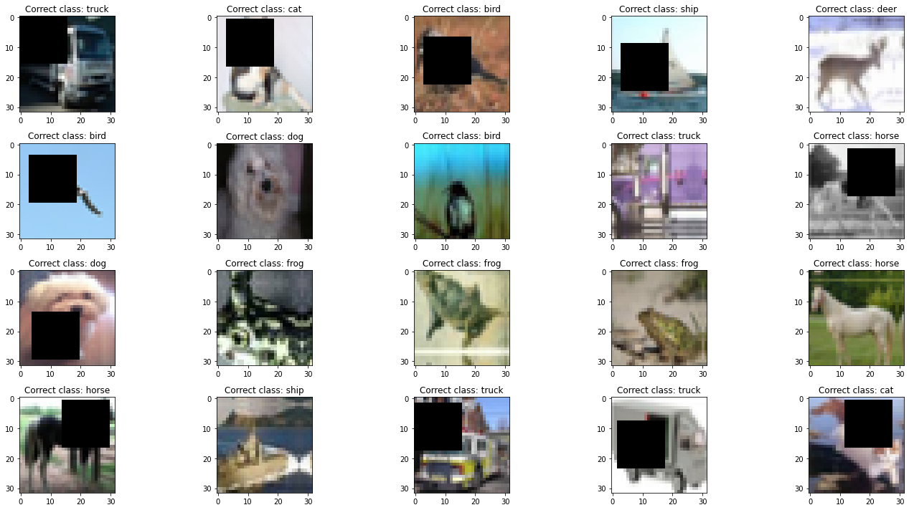
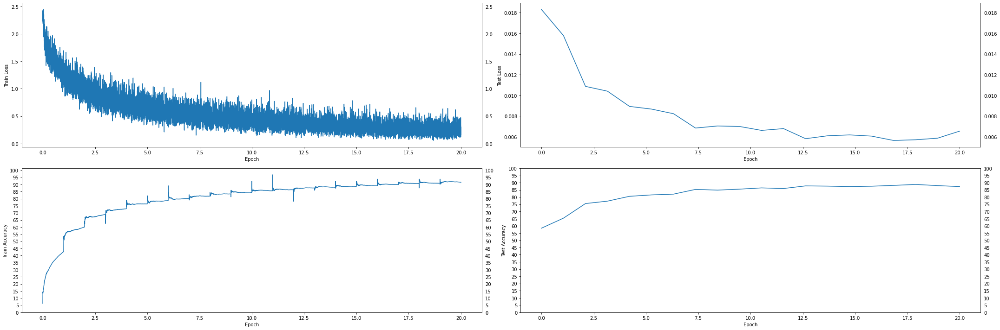

# **Assignment 7**

1. Check this Repo out: [Reference Repo](https://github.com/kuangliu/pytorch-cifar)
2. You are going to follow the same structure for your Code from now on. So Create:
   - models folder - this is where you'll add all of your future models. Copy resnet.py into this folder, this file should only have ResNet 18/34 models. Delete Bottleneck Class
   - main.py - from Google Colab, now onwards, this is the file that you'll import (along with the model). Your main file shall be able to take these params or you should be able to pull functions from it and then perform operations, like (including but not limited to):
     - training and test loops
     - data split between test and train
     - epochs
     - batch size
     - which optimizer to run
     - do we run a scheduler?
   - utils.py file (or a folder later on when it expands) - this is where you will add all of your utilities like: -image transforms,
     - gradcam,
     - misclassification code,
     - tensorboard related stuff
     - advanced training policies, etc
3. Name this main repos something, and don't call it Assignment 7. This is what you'll import for all the rest of the assignments. Add a proper readme describing all the files.
4. Your assignment is to build the above training structure. Train ResNet18 on Cifar10 for 20 Epochs. The assignment must:
   - pull your Github code to google colab (don't copy-paste code)
   - prove that you are following the above structure
   - that the code in your google collab notebook is NOTHING.. barely anything.
   - There should not be any function or class that you can define in your Google Colab Notebook. Everything must be imported from all of your other files
   - your colab file must:
     - train resnet18 for 20 epochs on the CIFAR10 dataset
     - show loss curves for test and train datasets
     - show a gallery of 10 misclassified images
     - show gradcam Links to an external site.output on 10 misclassified images. **Remember if you are applying GradCAM on a channel that is less than 5px, then please don't bother to submit the assignment.** 😡🤬🤬🤬🤬
   - Once done, upload the code to GitHub, and share the code. This readme must link to the main repo so we can read your file structure.
     - Train for 20 epochs
       - Get 10 misclassified images
       - Get 10 GradCam outputs on any misclassified images (remember that you **MUST** use the library we discussed in the class)
       - Apply these transforms while training:
         - RandomCrop(32, padding=4)
         - CutOut(16x16)
5. Assignment Submission Questions:
   - Share the **COMPLETE** code of your model.py
   - Share the **COMPLETE** code of your utils.py
   - Share the **COMPLETE** code of your main.py
   - Copy-paste the training log (cannot be ugly)
   - Copy-paste the 10/20 Misclassified Images Gallery
   - Copy-paste the 10/20 GradCam outputs Gallery
   - Share the link to your **MAIN** repo
   - Share the link to your **README** of Assignment 7 (cannot be in the **MAIN** Repo, but Assignment 7 repo)

<hr>
<br>
<br>

# Colab Link

## [Solution on Colab](https://colab.research.google.com/drive/1UdvIPAicwzppjDnQBu5-SJ5iIbnbJEoP?usp=sharing)

Or, check out the committed notebook file - `session7_assignment.ipynb`

# Notes

1. Trained for 20 epochs
2. Used **SGD** optimizer (`momentum = 0.9`)
3. Used **CrossEntropyLoss**
4. Used **OneCycleLR** scheduler with `max_lr = 0.1, steps_per_epoch=len(train_loader), epochs = 20`

# Sample Training Images



# Misclassified Images


# Misclassified Images with Grad-CAM


# Graphs



# Training logs (20 epochs)

```
EPOCH = 0 | LR = 0.0040000000000000036 | Loss = 1.17 | Batch = 781 | Accuracy = 43.87: 100%|██████████| 782/782 [00:48<00:00, 16.12it/s]
Test set: Average loss: 0.0181, Accuracy: 5960/10000 (59.60%)

EPOCH = 1 | LR = 0.004000010764159012 | Loss = 1.34 | Batch = 781 | Accuracy = 60.59: 100%|██████████| 782/782 [00:49<00:00, 15.79it/s]
Test set: Average loss: 0.0181, Accuracy: 6270/10000 (62.70%)

EPOCH = 2 | LR = 0.00400004305663125 | Loss = 0.91 | Batch = 781 | Accuracy = 69.27: 100%|██████████| 782/782 [00:50<00:00, 15.62it/s]
Test set: Average loss: 0.0127, Accuracy: 7277/10000 (72.77%)

EPOCH = 3 | LR = 0.004000096877402215 | Loss = 1.13 | Batch = 781 | Accuracy = 73.75: 100%|██████████| 782/782 [00:50<00:00, 15.58it/s]
Test set: Average loss: 0.0107, Accuracy: 7778/10000 (77.78%)

EPOCH = 4 | LR = 0.004000172226447746 | Loss = 0.83 | Batch = 781 | Accuracy = 76.72: 100%|██████████| 782/782 [00:50<00:00, 15.58it/s]
Test set: Average loss: 0.0086, Accuracy: 8143/10000 (81.43%)

EPOCH = 5 | LR = 0.0040002691037340915 | Loss = 0.45 | Batch = 781 | Accuracy = 79.00: 100%|██████████| 782/782 [00:50<00:00, 15.55it/s]
Test set: Average loss: 0.0083, Accuracy: 8260/10000 (82.60%)

EPOCH = 6 | LR = 0.004000387509217759 | Loss = 0.33 | Batch = 781 | Accuracy = 80.74: 100%|██████████| 782/782 [00:50<00:00, 15.55it/s]
Test set: Average loss: 0.0078, Accuracy: 8318/10000 (83.18%)

EPOCH = 7 | LR = 0.004000527442845694 | Loss = 0.65 | Batch = 781 | Accuracy = 82.22: 100%|██████████| 782/782 [00:50<00:00, 15.56it/s]
Test set: Average loss: 0.0075, Accuracy: 8421/10000 (84.21%)

EPOCH = 8 | LR = 0.004000688904555086 | Loss = 0.62 | Batch = 781 | Accuracy = 83.44: 100%|██████████| 782/782 [00:50<00:00, 15.55it/s]
Test set: Average loss: 0.0071, Accuracy: 8512/10000 (85.12%)

EPOCH = 9 | LR = 0.004000871894273547 | Loss = 0.67 | Batch = 781 | Accuracy = 84.56: 100%|██████████| 782/782 [00:50<00:00, 15.56it/s]
Test set: Average loss: 0.0063, Accuracy: 8652/10000 (86.52%)

EPOCH = 10 | LR = 0.004001076411918977 | Loss = 0.45 | Batch = 781 | Accuracy = 85.96: 100%|██████████| 782/782 [00:50<00:00, 15.56it/s]
Test set: Average loss: 0.0066, Accuracy: 8656/10000 (86.56%)

EPOCH = 11 | LR = 0.004001302457399672 | Loss = 0.71 | Batch = 781 | Accuracy = 86.99: 100%|██████████| 782/782 [00:50<00:00, 15.57it/s]
Test set: Average loss: 0.0060, Accuracy: 8737/10000 (87.37%)

EPOCH = 12 | LR = 0.004001550030614254 | Loss = 0.54 | Batch = 781 | Accuracy = 87.58: 100%|██████████| 782/782 [00:50<00:00, 15.56it/s]
Test set: Average loss: 0.0069, Accuracy: 8596/10000 (85.96%)

EPOCH = 13 | LR = 0.004001819131451659 | Loss = 0.27 | Batch = 781 | Accuracy = 88.49: 100%|██████████| 782/782 [00:50<00:00, 15.57it/s]
Test set: Average loss: 0.0063, Accuracy: 8740/10000 (87.40%)

EPOCH = 14 | LR = 0.004002109759791234 | Loss = 0.38 | Batch = 781 | Accuracy = 88.89: 100%|██████████| 782/782 [00:50<00:00, 15.56it/s]
Test set: Average loss: 0.0059, Accuracy: 8826/10000 (88.26%)

EPOCH = 15 | LR = 0.004002421915502596 | Loss = 0.35 | Batch = 781 | Accuracy = 89.59: 100%|██████████| 782/782 [00:50<00:00, 15.56it/s]
Test set: Average loss: 0.0061, Accuracy: 8777/10000 (87.77%)

EPOCH = 16 | LR = 0.004002755598445748 | Loss = 0.33 | Batch = 781 | Accuracy = 90.28: 100%|██████████| 782/782 [00:50<00:00, 15.58it/s]
Test set: Average loss: 0.0052, Accuracy: 8923/10000 (89.23%)

EPOCH = 17 | LR = 0.00400311080847103 | Loss = 0.16 | Batch = 781 | Accuracy = 90.88: 100%|██████████| 782/782 [00:50<00:00, 15.55it/s]
Test set: Average loss: 0.0058, Accuracy: 8864/10000 (88.64%)

EPOCH = 18 | LR = 0.00400348754541914 | Loss = 0.64 | Batch = 781 | Accuracy = 91.34: 100%|██████████| 782/782 [00:50<00:00, 15.56it/s]
Test set: Average loss: 0.0066, Accuracy: 8773/10000 (87.73%)

EPOCH = 19 | LR = 0.004003885809121088 | Loss = 0.36 | Batch = 781 | Accuracy = 91.81: 100%|██████████| 782/782 [00:50<00:00, 15.56it/s]
Test set: Average loss: 0.0062, Accuracy: 8823/10000 (88.23%)
```
