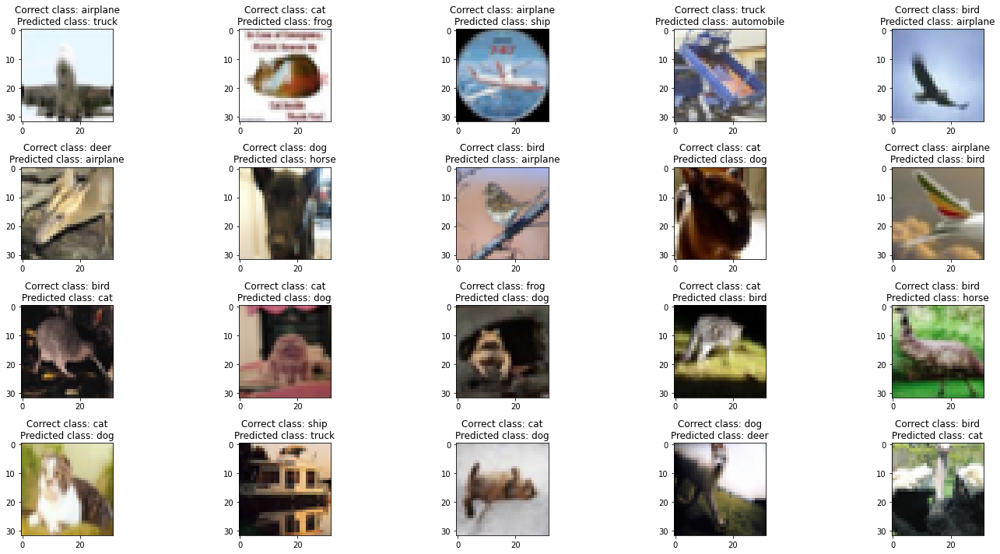

# **Assignment 8**

1.  Write a custom ResNet architecture for CIFAR10 that has the following architecture:

    - PrepLayer - Conv 3x3 s1, p1) >> BN >> RELU `[out channels = 64]`
    - Layer1
      - X = Conv 3x3 (s1, p1) >> MaxPool2D >> BN >> RELU `[out channels = 128]`
      - R1 = ResBlock( (Conv-BN-ReLU-Conv-BN-ReLU))(X) `[out channels = 128]`
      - Add(X, R1)
    - Layer 2
      - Conv 3x3 `[out channels = 256]`
      - MaxPooling2D
      - BN
      - ReLU
    - Layer 3
      - X = Conv 3x3 (s1, p1) >> MaxPool2D >> BN >> RELU `[out channels = 512]`
      - R2 = ResBlock( (Conv-BN-ReLU-Conv-BN-ReLU))(X) `[out channels = 512]`
      - Add(X, R2)
    - Max Pooling with Kernel Size 4
    - FC Layer
    - SoftMax

2.  Uses One Cycle Policy such that:
    - Total Epochs = 24
    - Max at Epoch = 5
    - LRMIN = FIND
    - LRMAX = FIND
    - No Annihilation
3.  Uses these transforms

    - RandomCrop(32, 32) (after padding of 4)
    - FlipLR
    - Followed by CutOut(8, 8)

4.  Batch size = 512

5.  Target Accuracy: 90% (93.8% quadruple scores).

6.  No score if your code is not modular. Your collab must be importing your GitHub package, and then just running the model. I should be able to find the custom_resnet.py model in your GitHub repo that you'd be training.

7.  Once done, proceed to answer the Assignment-Solution page.

# Colab Link

## [Solution on Colab](https://colab.research.google.com/drive/1j65oWwpfFhLDtP9MOT8xU4GpKiO3qfTB?usp=sharing)

Or, check out the committed notebook file - `session8_assignment.ipynb`

# Model Parameters

```
==============================================================================================================================================================================================
Layer (type (var_name))                  Kernel Shape              Input Shape               Output Shape              Param #                   Mult-Adds                 Trainable
==============================================================================================================================================================================================
CustomResNet (CustomResNet)              --                        [20, 3, 32, 32]           [20, 10]                  --                        --                        True
├─Sequential (prep_layer)                --                        [20, 3, 32, 32]           [20, 64, 32, 32]          --                        --                        True
│    └─Conv2d (0)                        [3, 3]                    [20, 3, 32, 32]           [20, 64, 32, 32]          1,728                     35,389,440                True
│    └─BatchNorm2d (1)                   --                        [20, 64, 32, 32]          [20, 64, 32, 32]          128                       2,560                     True
│    └─ReLU (2)                          --                        [20, 64, 32, 32]          [20, 64, 32, 32]          --                        --                        --
├─CustomBlock (layer_1)                  --                        [20, 64, 32, 32]          [20, 128, 16, 16]         --                        --                        True
│    └─Sequential (inner_layer)          --                        [20, 64, 32, 32]          [20, 128, 16, 16]         --                        --                        True
│    │    └─Conv2d (0)                   [3, 3]                    [20, 64, 32, 32]          [20, 128, 32, 32]         73,728                    1,509,949,440             True
│    │    └─MaxPool2d (1)                2                         [20, 128, 32, 32]         [20, 128, 16, 16]         --                        --                        --
│    │    └─BatchNorm2d (2)              --                        [20, 128, 16, 16]         [20, 128, 16, 16]         256                       5,120                     True
│    │    └─ReLU (3)                     --                        [20, 128, 16, 16]         [20, 128, 16, 16]         --                        --                        --
│    └─BasicBlock (res_block)            --                        [20, 128, 16, 16]         [20, 128, 16, 16]         --                        --                        True
│    │    └─Conv2d (conv1)               [3, 3]                    [20, 128, 16, 16]         [20, 128, 16, 16]         147,456                   754,974,720               True
│    │    └─BatchNorm2d (bn1)            --                        [20, 128, 16, 16]         [20, 128, 16, 16]         256                       5,120                     True
│    │    └─Conv2d (conv2)               [3, 3]                    [20, 128, 16, 16]         [20, 128, 16, 16]         147,456                   754,974,720               True
│    │    └─BatchNorm2d (bn2)            --                        [20, 128, 16, 16]         [20, 128, 16, 16]         256                       5,120                     True
│    │    └─Sequential (shortcut)        --                        [20, 128, 16, 16]         [20, 128, 16, 16]         --                        --                        --
├─Sequential (layer_2)                   --                        [20, 128, 16, 16]         [20, 256, 8, 8]           --                        --                        True
│    └─Conv2d (0)                        [3, 3]                    [20, 128, 16, 16]         [20, 256, 16, 16]         294,912                   1,509,949,440             True
│    └─MaxPool2d (1)                     2                         [20, 256, 16, 16]         [20, 256, 8, 8]           --                        --                        --
│    └─BatchNorm2d (2)                   --                        [20, 256, 8, 8]           [20, 256, 8, 8]           512                       10,240                    True
│    └─ReLU (3)                          --                        [20, 256, 8, 8]           [20, 256, 8, 8]           --                        --                        --
├─CustomBlock (layer_3)                  --                        [20, 256, 8, 8]           [20, 512, 4, 4]           --                        --                        True
│    └─Sequential (inner_layer)          --                        [20, 256, 8, 8]           [20, 512, 4, 4]           --                        --                        True
│    │    └─Conv2d (0)                   [3, 3]                    [20, 256, 8, 8]           [20, 512, 8, 8]           1,179,648                 1,509,949,440             True
│    │    └─MaxPool2d (1)                2                         [20, 512, 8, 8]           [20, 512, 4, 4]           --                        --                        --
│    │    └─BatchNorm2d (2)              --                        [20, 512, 4, 4]           [20, 512, 4, 4]           1,024                     20,480                    True
│    │    └─ReLU (3)                     --                        [20, 512, 4, 4]           [20, 512, 4, 4]           --                        --                        --
│    └─BasicBlock (res_block)            --                        [20, 512, 4, 4]           [20, 512, 4, 4]           --                        --                        True
│    │    └─Conv2d (conv1)               [3, 3]                    [20, 512, 4, 4]           [20, 512, 4, 4]           2,359,296                 754,974,720               True
│    │    └─BatchNorm2d (bn1)            --                        [20, 512, 4, 4]           [20, 512, 4, 4]           1,024                     20,480                    True
│    │    └─Conv2d (conv2)               [3, 3]                    [20, 512, 4, 4]           [20, 512, 4, 4]           2,359,296                 754,974,720               True
│    │    └─BatchNorm2d (bn2)            --                        [20, 512, 4, 4]           [20, 512, 4, 4]           1,024                     20,480                    True
│    │    └─Sequential (shortcut)        --                        [20, 512, 4, 4]           [20, 512, 4, 4]           --                        --                        --
├─Sequential (max_pool)                  --                        [20, 512, 4, 4]           [20, 512, 1, 1]           --                        --                        --
│    └─MaxPool2d (0)                     4                         [20, 512, 4, 4]           [20, 512, 1, 1]           --                        --                        --
├─Linear (fc)                            --                        [20, 512]                 [20, 10]                  5,130                     102,600                   True
==============================================================================================================================================================================================
Total params: 6,573,130
Trainable params: 6,573,130
Non-trainable params: 0
Total mult-adds (G): 7.59
==============================================================================================================================================================================================
Input size (MB): 0.25
Forward/backward pass size (MB): 93.06
Params size (MB): 26.29
Estimated Total Size (MB): 119.60
==============================================================================================================================================================================================
```

# Notes

1. Trained for 24 epochs
2. Used **SGD** optimizer (`lr=0.001, momentum = 0.9`)
3. Used **LRFinder** with (`end_lr=10, num_iter=200, step_mode='exp'`)
   - Min Loss = `2.5940928201241054`
   - Max LR = `0.01933891750455231`
4. Used **CrossEntropyLoss**
5. Used **OneCycleLR** scheduler with (`max_lr=max_lr, pct_start=5/EPOCHS, div_factor=100, three_phase=False, final_div_factor=100, anneal_strategy='linear'`)

# Results

1. Max Accuracy = `90.52%` at Epoch 24
2. Max LR = `0.01933891750455231`
3. Min LR = `-8.451169266086855e-06`

# Sample Training Images


# Misclassified Images



# Misclassified Images Grad-CAM

## vs Correct class

This is what the model sees for the correct class, but it's not enough for it to predict it.

### **Layer 2**


### **Layer 3**


## vs Predicted class

This is what the model sees that it based its prediction on.

### **Layer 2**


### **Layer 3**


# Loss and Accuracy Graphs


# LR Finder Graph


# Training LR History Graph


# Training logs (24 epochs)

```
EPOCH = 1 | LR = 0.004030325322881239 | Loss = 1.37 | Batch = 97 | Accuracy = 35.77: 100%|██████████| 98/98 [00:23<00:00,  4.20it/s]
Test set: Average loss: 0.0029, Accuracy: 4886/10000 (48.86%)

EPOCH = 2 | LR = 0.007867261470716955 | Loss = 1.18 | Batch = 97 | Accuracy = 53.44: 100%|██████████| 98/98 [00:24<00:00,  4.05it/s]
Test set: Average loss: 0.0026, Accuracy: 5673/10000 (56.73%)

EPOCH = 3 | LR = 0.011704197618552672 | Loss = 1.11 | Batch = 97 | Accuracy = 62.49: 100%|██████████| 98/98 [00:24<00:00,  4.01it/s]
Test set: Average loss: 0.0033, Accuracy: 5417/10000 (54.17%)

EPOCH = 4 | LR = 0.015541133766388387 | Loss = 0.82 | Batch = 97 | Accuracy = 67.79: 100%|██████████| 98/98 [00:24<00:00,  4.07it/s]
Test set: Average loss: 0.0019, Accuracy: 7019/10000 (70.19%)

EPOCH = 5 | LR = 0.01932853244353577 | Loss = 0.63 | Batch = 97 | Accuracy = 71.66: 100%|██████████| 98/98 [00:24<00:00,  4.07it/s]
Test set: Average loss: 0.0017, Accuracy: 7407/10000 (74.07%)

EPOCH = 6 | LR = 0.01831079646391462 | Loss = 0.78 | Batch = 97 | Accuracy = 75.68: 100%|██████████| 98/98 [00:24<00:00,  4.05it/s]
Test set: Average loss: 0.0023, Accuracy: 6975/10000 (69.75%)

EPOCH = 7 | LR = 0.017293060484293465 | Loss = 0.67 | Batch = 97 | Accuracy = 79.56: 100%|██████████| 98/98 [00:24<00:00,  4.07it/s]
Test set: Average loss: 0.0013, Accuracy: 7951/10000 (79.51%)

EPOCH = 8 | LR = 0.01627532450467232 | Loss = 0.49 | Batch = 97 | Accuracy = 81.49: 100%|██████████| 98/98 [00:24<00:00,  4.07it/s]
Test set: Average loss: 0.0011, Accuracy: 8233/10000 (82.33%)

EPOCH = 9 | LR = 0.015257588525051166 | Loss = 0.49 | Batch = 97 | Accuracy = 83.41: 100%|██████████| 98/98 [00:24<00:00,  4.06it/s]
Test set: Average loss: 0.0010, Accuracy: 8362/10000 (83.62%)

EPOCH = 10 | LR = 0.014239852545430016 | Loss = 0.39 | Batch = 97 | Accuracy = 84.69: 100%|██████████| 98/98 [00:24<00:00,  4.06it/s]
Test set: Average loss: 0.0014, Accuracy: 7925/10000 (79.25%)

EPOCH = 11 | LR = 0.013222116565808866 | Loss = 0.42 | Batch = 97 | Accuracy = 86.18: 100%|██████████| 98/98 [00:24<00:00,  4.07it/s]
Test set: Average loss: 0.0010, Accuracy: 8436/10000 (84.36%)

EPOCH = 12 | LR = 0.012204380586187715 | Loss = 0.54 | Batch = 97 | Accuracy = 87.07: 100%|██████████| 98/98 [00:24<00:00,  4.06it/s]
Test set: Average loss: 0.0009, Accuracy: 8554/10000 (85.54%)

EPOCH = 13 | LR = 0.011186644606566565 | Loss = 0.40 | Batch = 97 | Accuracy = 87.77: 100%|██████████| 98/98 [00:24<00:00,  4.07it/s]
Test set: Average loss: 0.0008, Accuracy: 8630/10000 (86.30%)

EPOCH = 14 | LR = 0.010168908626945415 | Loss = 0.34 | Batch = 97 | Accuracy = 88.62: 100%|██████████| 98/98 [00:24<00:00,  4.07it/s]
Test set: Average loss: 0.0008, Accuracy: 8683/10000 (86.83%)

EPOCH = 15 | LR = 0.009151172647324264 | Loss = 0.27 | Batch = 97 | Accuracy = 89.14: 100%|██████████| 98/98 [00:24<00:00,  4.06it/s]
Test set: Average loss: 0.0009, Accuracy: 8532/10000 (85.32%)

EPOCH = 16 | LR = 0.008133436667703116 | Loss = 0.26 | Batch = 97 | Accuracy = 90.26: 100%|██████████| 98/98 [00:24<00:00,  4.06it/s]
Test set: Average loss: 0.0008, Accuracy: 8764/10000 (87.64%)

EPOCH = 17 | LR = 0.007115700688081964 | Loss = 0.26 | Batch = 97 | Accuracy = 90.91: 100%|██████████| 98/98 [00:24<00:00,  4.06it/s]
Test set: Average loss: 0.0008, Accuracy: 8811/10000 (88.11%)

EPOCH = 18 | LR = 0.006097964708460812 | Loss = 0.22 | Batch = 97 | Accuracy = 91.62: 100%|██████████| 98/98 [00:24<00:00,  4.07it/s]
Test set: Average loss: 0.0008, Accuracy: 8848/10000 (88.48%)

EPOCH = 19 | LR = 0.005080228728839663 | Loss = 0.19 | Batch = 97 | Accuracy = 91.93: 100%|██████████| 98/98 [00:24<00:00,  4.07it/s]
Test set: Average loss: 0.0007, Accuracy: 8899/10000 (88.99%)

EPOCH = 20 | LR = 0.004062492749218513 | Loss = 0.24 | Batch = 97 | Accuracy = 93.06: 100%|██████████| 98/98 [00:24<00:00,  4.07it/s]
Test set: Average loss: 0.0008, Accuracy: 8842/10000 (88.42%)

EPOCH = 21 | LR = 0.003044756769597364 | Loss = 0.16 | Batch = 97 | Accuracy = 93.63: 100%|██████████| 98/98 [00:24<00:00,  4.06it/s]
Test set: Average loss: 0.0007, Accuracy: 8969/10000 (89.69%)

EPOCH = 22 | LR = 0.0020270207899762104 | Loss = 0.14 | Batch = 97 | Accuracy = 94.62: 100%|██████████| 98/98 [00:24<00:00,  4.06it/s]
Test set: Average loss: 0.0007, Accuracy: 8987/10000 (89.87%)

EPOCH = 23 | LR = 0.0010092848103550635 | Loss = 0.11 | Batch = 97 | Accuracy = 95.07: 100%|██████████| 98/98 [00:24<00:00,  4.07it/s]
Test set: Average loss: 0.0006, Accuracy: 9010/10000 (90.10%)

EPOCH = 24 | LR = -8.451169266086855e-06 | Loss = 0.19 | Batch = 97 | Accuracy = 95.85: 100%|██████████| 98/98 [00:24<00:00,  4.07it/s]
Test set: Average loss: 0.0006, Accuracy: 9052/10000 (90.52%)
```
