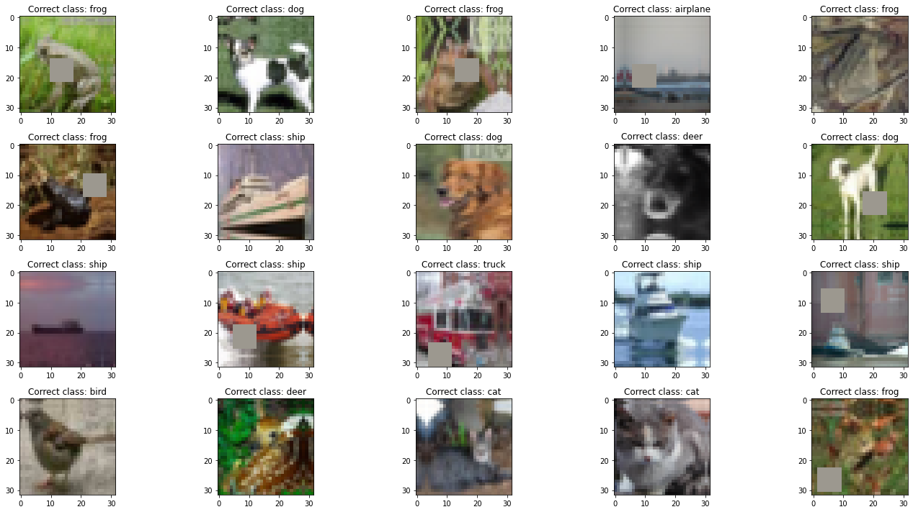
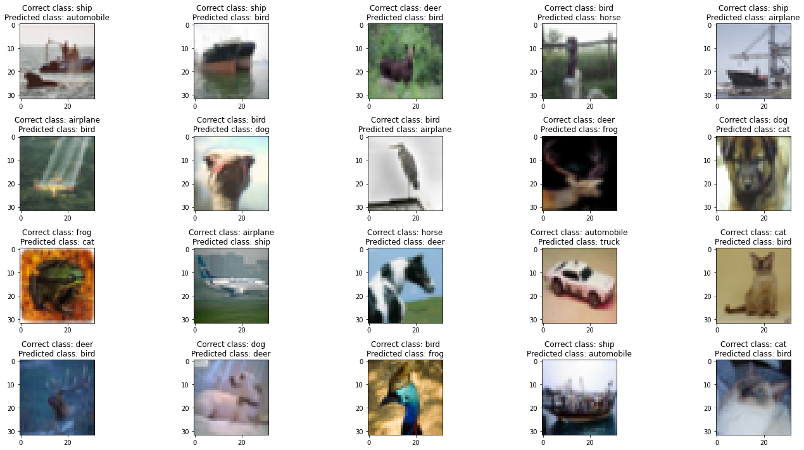
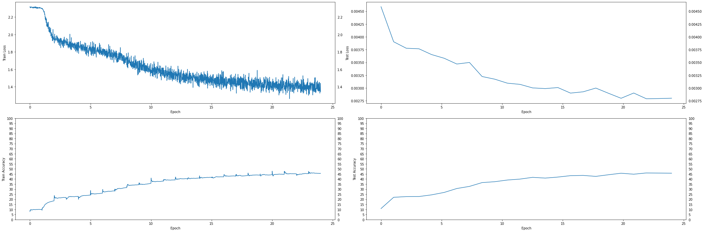
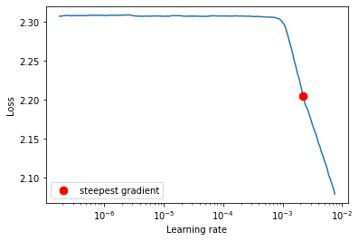
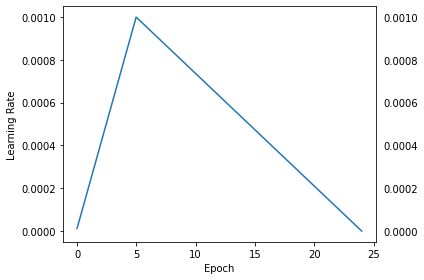

# **Assignment 9**

## Build the following network:

1. That takes a CIFAR10 image (32x32x3)
2. Add 3 Convolutions to arrive at AxAx48 dimensions (e.g. 32x32x3 | 3x3x3x16 >> 3x3x16x32 >> 3x3x32x48)
3. Apply GAP and get 1x1x48, call this X
4. Create a block called ULTIMUS that:

   - Creates 3 FC layers called K, Q and V such that:
     - X\*K = 48\*48x8 > 8
     - X\*Q = 48\*48x8 > 8
     - X\*V = 48\*48x8 > 8
   - then create AM = SoftMax(QTK)/(8^0.5) = 8\*8 = 8
   - then Z = V\*AM = 8\*8 > 8
   - then another FC layer called Out that:
     - Z\*Out = 8\*8x48 > 48

5. Repeat this Ultimus block 4 times
6. Then add final FC layer that converts 48 to 10 and sends it to the loss function.
7. Model would look like this C>C>C>U>U>U>U>FFC>Loss
8. Train the model for 24 epochs using the OCP that I wrote in class. Use ADAM as an optimizer.
9. Submit the link and answer the questions on the assignment page:
   - Share the link to the main repo (must have Assignment 7/8/9 model7/8/9.py files (or similarly named))
   - Share the code of model9.py
   - Copy and paste the Training Log
   - Copy and paste the training and validation loss chart

# Colab Link

## [Solution on Colab](https://colab.research.google.com/drive/1uCKS0IVCrOzplCmlMoYQwym-PEW0VVVs?usp=sharing)

Or, check out the committed notebook file - `session9_assignment.ipynb`

# Model Parameters

```
==============================================================================================================================================================================================
Layer (type (var_name))                  Kernel Shape              Input Shape               Output Shape              Param #                   Mult-Adds                 Trainable
==============================================================================================================================================================================================
TransformerModel (TransformerModel)      --                        [20, 3, 32, 32]           [20, 10]                  --                        --                        True
├─Sequential (conv_block)                --                        [20, 3, 32, 32]           [20, 48, 32, 32]          --                        --                        True
│    └─Conv2d (0)                        [3, 3]                    [20, 3, 32, 32]           [20, 16, 32, 32]          448                       9,175,040                 True
│    └─BatchNorm2d (1)                   --                        [20, 16, 32, 32]          [20, 16, 32, 32]          32                        640                       True
│    └─ReLU (2)                          --                        [20, 16, 32, 32]          [20, 16, 32, 32]          --                        --                        --
│    └─Dropout (3)                       --                        [20, 16, 32, 32]          [20, 16, 32, 32]          --                        --                        --
│    └─Conv2d (4)                        [3, 3]                    [20, 16, 32, 32]          [20, 32, 32, 32]          4,640                     95,027,200                True
│    └─BatchNorm2d (5)                   --                        [20, 32, 32, 32]          [20, 32, 32, 32]          64                        1,280                     True
│    └─ReLU (6)                          --                        [20, 32, 32, 32]          [20, 32, 32, 32]          --                        --                        --
│    └─Dropout (7)                       --                        [20, 32, 32, 32]          [20, 32, 32, 32]          --                        --                        --
│    └─Conv2d (8)                        [3, 3]                    [20, 32, 32, 32]          [20, 48, 32, 32]          13,872                    284,098,560               True
│    └─BatchNorm2d (9)                   --                        [20, 48, 32, 32]          [20, 48, 32, 32]          96                        1,920                     True
│    └─ReLU (10)                         --                        [20, 48, 32, 32]          [20, 48, 32, 32]          --                        --                        --
│    └─Dropout (11)                      --                        [20, 48, 32, 32]          [20, 48, 32, 32]          --                        --                        --
├─AdaptiveAvgPool2d (gap)                --                        [20, 48, 32, 32]          [20, 48, 1, 1]            --                        --                        --
├─Sequential (ultimus_blocks)            --                        [20, 48]                  [20, 1, 48]               --                        --                        True
│    └─UltimusBlock (0)                  --                        [20, 48]                  [20, 1, 48]               --                        --                        True
│    │    └─Linear (fc_k)                --                        [20, 48]                  [20, 8]                   392                       7,840                     True
│    │    └─Linear (fc_q)                --                        [20, 48]                  [20, 8]                   392                       7,840                     True
│    │    └─Linear (fc_v)                --                        [20, 48]                  [20, 8]                   392                       7,840                     True
│    │    └─Linear (fc_out)              --                        [20, 1, 8]                [20, 1, 48]               432                       8,640                     True
│    └─UltimusBlock (1)                  --                        [20, 1, 48]               [20, 1, 48]               --                        --                        True
│    │    └─Linear (fc_k)                --                        [20, 1, 48]               [20, 1, 8]                392                       7,840                     True
│    │    └─Linear (fc_q)                --                        [20, 1, 48]               [20, 1, 8]                392                       7,840                     True
│    │    └─Linear (fc_v)                --                        [20, 1, 48]               [20, 1, 8]                392                       7,840                     True
│    │    └─Linear (fc_out)              --                        [20, 1, 8]                [20, 1, 48]               432                       8,640                     True
│    └─UltimusBlock (2)                  --                        [20, 1, 48]               [20, 1, 48]               --                        --                        True
│    │    └─Linear (fc_k)                --                        [20, 1, 48]               [20, 1, 8]                392                       7,840                     True
│    │    └─Linear (fc_q)                --                        [20, 1, 48]               [20, 1, 8]                392                       7,840                     True
│    │    └─Linear (fc_v)                --                        [20, 1, 48]               [20, 1, 8]                392                       7,840                     True
│    │    └─Linear (fc_out)              --                        [20, 1, 8]                [20, 1, 48]               432                       8,640                     True
│    └─UltimusBlock (3)                  --                        [20, 1, 48]               [20, 1, 48]               --                        --                        True
│    │    └─Linear (fc_k)                --                        [20, 1, 48]               [20, 1, 8]                392                       7,840                     True
│    │    └─Linear (fc_q)                --                        [20, 1, 48]               [20, 1, 8]                392                       7,840                     True
│    │    └─Linear (fc_v)                --                        [20, 1, 48]               [20, 1, 8]                392                       7,840                     True
│    │    └─Linear (fc_out)              --                        [20, 1, 8]                [20, 1, 48]               432                       8,640                     True
├─Linear (final_fc)                      --                        [20, 1, 48]               [20, 1, 10]               480                       9,600                     True
==============================================================================================================================================================================================
Total params: 26,064
Trainable params: 26,064
Non-trainable params: 0
Total mult-adds (M): 388.44
==============================================================================================================================================================================================
Input size (MB): 0.25
Forward/backward pass size (MB): 31.50
Params size (MB): 0.10
Estimated Total Size (MB): 31.86
==============================================================================================================================================================================================
```

# Notes

1. Trained for 24 epochs
2. Used **Adam** optimizer (`lr=1e-7`)
3. Used **LRFinder** with (`end_lr=0.001, num_iter=200, step_mode='exp'`)
   - Min Loss = `2.189714883543986`
   - Max LR = `0.001`
4. Used **CrossEntropyLoss**
5. Used **OneCycleLR** scheduler with (`max_lr=max_lr, pct_start=5/EPOCHS, div_factor=100, three_phase=False, final_div_factor=1000, anneal_strategy='linear'`)

# Results

1. Max Accuracy = `46.02%` at Epoch 22
2. Max LR = `0.001`
3. Min LR = `-5.270515574650608e-07`

# Sample Training Images



# Misclassified Images



# Loss and Accuracy Graphs



# LR Finder Graph



# Training LR History Graph



# Training logs (24 epochs)

```
EPOCH = 1 | LR = 0.00020840490797546012 | Loss = 2.30 | Batch = 97 | Accuracy = 10.01: 100%|██████████| 98/98 [00:15<00:00,  6.36it/s]
Test set: Average loss: 0.0046, Accuracy: 1085/10000 (10.85%)

EPOCH = 2 | LR = 0.0004068098159509203 | Loss = 1.95 | Batch = 97 | Accuracy = 18.53: 100%|██████████| 98/98 [00:16<00:00,  6.03it/s]
Test set: Average loss: 0.0039, Accuracy: 2197/10000 (21.97%)

EPOCH = 3 | LR = 0.0006052147239263804 | Loss = 1.88 | Batch = 97 | Accuracy = 21.81: 100%|██████████| 98/98 [00:15<00:00,  6.14it/s]
Test set: Average loss: 0.0038, Accuracy: 2267/10000 (22.67%)

EPOCH = 4 | LR = 0.0008036196319018405 | Loss = 1.91 | Batch = 97 | Accuracy = 22.90: 100%|██████████| 98/98 [00:16<00:00,  6.11it/s]
Test set: Average loss: 0.0038, Accuracy: 2273/10000 (22.73%)

EPOCH = 5 | LR = 0.000999462948442535 | Loss = 1.86 | Batch = 97 | Accuracy = 24.23: 100%|██████████| 98/98 [00:16<00:00,  6.09it/s]
Test set: Average loss: 0.0037, Accuracy: 2438/10000 (24.38%)

EPOCH = 6 | LR = 0.000946831895810956 | Loss = 1.83 | Batch = 97 | Accuracy = 26.08: 100%|██████████| 98/98 [00:17<00:00,  5.76it/s]
Test set: Average loss: 0.0036, Accuracy: 2678/10000 (26.78%)

EPOCH = 7 | LR = 0.0008942008431793771 | Loss = 1.80 | Batch = 97 | Accuracy = 28.40: 100%|██████████| 98/98 [00:15<00:00,  6.20it/s]
Test set: Average loss: 0.0035, Accuracy: 3065/10000 (30.65%)

EPOCH = 8 | LR = 0.0008415697905477981 | Loss = 1.65 | Batch = 97 | Accuracy = 31.55: 100%|██████████| 98/98 [00:15<00:00,  6.14it/s]
Test set: Average loss: 0.0035, Accuracy: 3274/10000 (32.74%)

EPOCH = 9 | LR = 0.0007889387379162191 | Loss = 1.69 | Batch = 97 | Accuracy = 34.42: 100%|██████████| 98/98 [00:15<00:00,  6.17it/s]
Test set: Average loss: 0.0032, Accuracy: 3650/10000 (36.50%)

EPOCH = 10 | LR = 0.0007363076852846401 | Loss = 1.56 | Batch = 97 | Accuracy = 35.81: 100%|██████████| 98/98 [00:16<00:00,  5.82it/s]
Test set: Average loss: 0.0032, Accuracy: 3737/10000 (37.37%)

EPOCH = 11 | LR = 0.0006836766326530613 | Loss = 1.61 | Batch = 97 | Accuracy = 37.97: 100%|██████████| 98/98 [00:16<00:00,  6.12it/s]
Test set: Average loss: 0.0031, Accuracy: 3903/10000 (39.03%)

EPOCH = 12 | LR = 0.0006310455800214822 | Loss = 1.54 | Batch = 97 | Accuracy = 39.10: 100%|██████████| 98/98 [00:16<00:00,  6.11it/s]
Test set: Average loss: 0.0031, Accuracy: 3996/10000 (39.96%)

EPOCH = 13 | LR = 0.0005784145273899033 | Loss = 1.49 | Batch = 97 | Accuracy = 40.34: 100%|██████████| 98/98 [00:15<00:00,  6.23it/s]
Test set: Average loss: 0.0030, Accuracy: 4168/10000 (41.68%)

EPOCH = 14 | LR = 0.0005257834747583244 | Loss = 1.53 | Batch = 97 | Accuracy = 41.09: 100%|██████████| 98/98 [00:15<00:00,  6.21it/s]
Test set: Average loss: 0.0030, Accuracy: 4094/10000 (40.94%)

EPOCH = 15 | LR = 0.00047315242212674536 | Loss = 1.42 | Batch = 97 | Accuracy = 41.69: 100%|██████████| 98/98 [00:15<00:00,  6.42it/s]
Test set: Average loss: 0.0030, Accuracy: 4196/10000 (41.96%)

EPOCH = 16 | LR = 0.00042052136949516654 | Loss = 1.47 | Batch = 97 | Accuracy = 42.14: 100%|██████████| 98/98 [00:15<00:00,  6.33it/s]
Test set: Average loss: 0.0029, Accuracy: 4335/10000 (43.35%)

EPOCH = 17 | LR = 0.0003678903168635875 | Loss = 1.46 | Batch = 97 | Accuracy = 42.94: 100%|██████████| 98/98 [00:16<00:00,  6.11it/s]
Test set: Average loss: 0.0029, Accuracy: 4358/10000 (43.58%)

EPOCH = 18 | LR = 0.0003152592642320085 | Loss = 1.43 | Batch = 97 | Accuracy = 43.49: 100%|██████████| 98/98 [00:15<00:00,  6.17it/s]
Test set: Average loss: 0.0030, Accuracy: 4263/10000 (42.63%)

EPOCH = 19 | LR = 0.00026262821160042966 | Loss = 1.51 | Batch = 97 | Accuracy = 43.87: 100%|██████████| 98/98 [00:15<00:00,  6.30it/s]
Test set: Average loss: 0.0029, Accuracy: 4424/10000 (44.24%)

EPOCH = 20 | LR = 0.00020999715896885063 | Loss = 1.46 | Batch = 97 | Accuracy = 44.27: 100%|██████████| 98/98 [00:15<00:00,  6.30it/s]
Test set: Average loss: 0.0028, Accuracy: 4575/10000 (45.75%)

EPOCH = 21 | LR = 0.0001573661063372717 | Loss = 1.39 | Batch = 97 | Accuracy = 44.67: 100%|██████████| 98/98 [00:15<00:00,  6.32it/s]
Test set: Average loss: 0.0029, Accuracy: 4478/10000 (44.78%)

EPOCH = 22 | LR = 0.00010473505370569268 | Loss = 1.43 | Batch = 97 | Accuracy = 45.11: 100%|██████████| 98/98 [00:15<00:00,  6.16it/s]
Test set: Average loss: 0.0028, Accuracy: 4602/10000 (46.02%)

EPOCH = 23 | LR = 5.210400107411386e-05 | Loss = 1.42 | Batch = 97 | Accuracy = 45.36: 100%|██████████| 98/98 [00:15<00:00,  6.36it/s]
Test set: Average loss: 0.0028, Accuracy: 4587/10000 (45.87%)

EPOCH = 24 | LR = -5.270515574650608e-07 | Loss = 1.34 | Batch = 97 | Accuracy = 45.56: 100%|██████████| 98/98 [00:15<00:00,  6.32it/s]
Test set: Average loss: 0.0028, Accuracy: 4577/10000 (45.77%)
```
