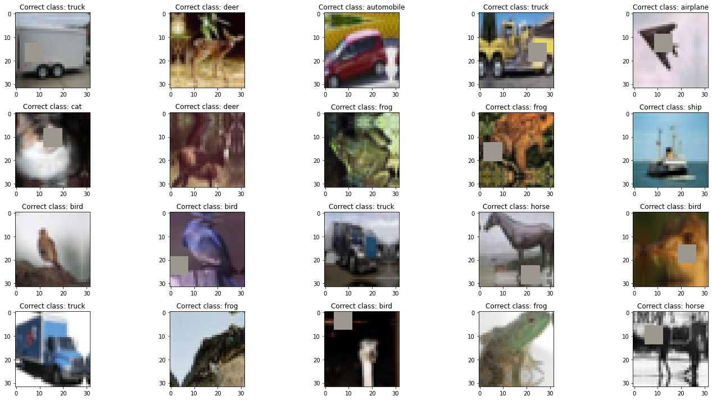
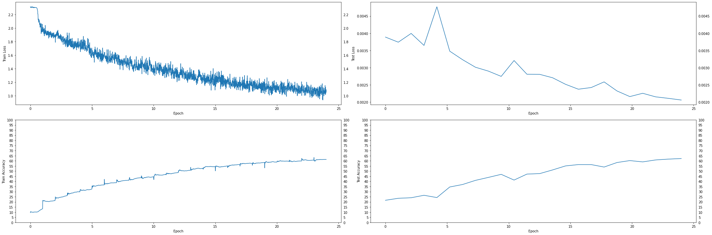

# **Assignment 9**

## Build the following network:

1. That takes a CIFAR10 image (32x32x3)
2. Add 3 Convolutions to arrive at AxAx48 dimensions (e.g. 32x32x3 | 3x3x3x16 >> 3x3x16x32 >> 3x3x32x48)
3. Apply GAP and get 1x1x48, call this X
4. Create a block called ULTIMUS that:

   - Creates 3 FC layers called K, Q and V such that:
     - X\*K = 48\*48x8 > 8
     - X\*Q = 48\*48x8 > 8
     - X\*V = 48\*48x8 > 8
   - then create AM = SoftMax(QTK)/(8^0.5) = 8\*8 = 8
   - then Z = V\*AM = 8\*8 > 8
   - then another FC layer called Out that:
     - Z\*Out = 8\*8x48 > 48

5. Repeat this Ultimus block 4 times
6. Then add final FC layer that converts 48 to 10 and sends it to the loss function.
7. Model would look like this C>C>C>U>U>U>U>FFC>Loss
8. Train the model for 24 epochs using the OCP that I wrote in class. Use ADAM as an optimizer.
9. Submit the link and answer the questions on the assignment page:
   - Share the link to the main repo (must have Assignment 7/8/9 model7/8/9.py files (or similarly named))
   - Share the code of model9.py
   - Copy and paste the Training Log
   - Copy and paste the training and validation loss chart

# Colab Link

## [Solution on Colab](https://colab.research.google.com/drive/167YLeeNWg57NIKJnm9XoakD2IPHQXNKy?usp=sharing)

Or, check out the committed notebook file - `session9_assignment.ipynb`

# Model Parameters

```
==============================================================================================================================================================================================
Layer (type (var_name))                  Kernel Shape              Input Shape               Output Shape              Param #                   Mult-Adds                 Trainable
==============================================================================================================================================================================================
TransformerModel (TransformerModel)      --                        [20, 3, 32, 32]           [20, 10]                  --                        --                        True
├─Sequential (conv_block)                --                        [20, 3, 32, 32]           [20, 48, 32, 32]          --                        --                        True
│    └─Conv2d (0)                        [3, 3]                    [20, 3, 32, 32]           [20, 16, 32, 32]          448                       9,175,040                 True
│    └─BatchNorm2d (1)                   --                        [20, 16, 32, 32]          [20, 16, 32, 32]          32                        640                       True
│    └─ReLU (2)                          --                        [20, 16, 32, 32]          [20, 16, 32, 32]          --                        --                        --
│    └─Dropout (3)                       --                        [20, 16, 32, 32]          [20, 16, 32, 32]          --                        --                        --
│    └─Conv2d (4)                        [3, 3]                    [20, 16, 32, 32]          [20, 32, 32, 32]          4,640                     95,027,200                True
│    └─BatchNorm2d (5)                   --                        [20, 32, 32, 32]          [20, 32, 32, 32]          64                        1,280                     True
│    └─ReLU (6)                          --                        [20, 32, 32, 32]          [20, 32, 32, 32]          --                        --                        --
│    └─Dropout (7)                       --                        [20, 32, 32, 32]          [20, 32, 32, 32]          --                        --                        --
│    └─Conv2d (8)                        [3, 3]                    [20, 32, 32, 32]          [20, 48, 32, 32]          13,872                    284,098,560               True
│    └─BatchNorm2d (9)                   --                        [20, 48, 32, 32]          [20, 48, 32, 32]          96                        1,920                     True
│    └─ReLU (10)                         --                        [20, 48, 32, 32]          [20, 48, 32, 32]          --                        --                        --
│    └─Dropout (11)                      --                        [20, 48, 32, 32]          [20, 48, 32, 32]          --                        --                        --
├─AdaptiveAvgPool2d (gap)                --                        [20, 48, 32, 32]          [20, 48, 1, 1]            --                        --                        --
├─Sequential (ultimus_blocks)            --                        [20, 48]                  [20, 1, 48]               --                        --                        True
│    └─UltimusBlock (0)                  --                        [20, 48]                  [20, 1, 48]               --                        --                        True
│    │    └─Linear (fc_k)                --                        [20, 48]                  [20, 8]                   392                       7,840                     True
│    │    └─Linear (fc_q)                --                        [20, 48]                  [20, 8]                   392                       7,840                     True
│    │    └─Linear (fc_v)                --                        [20, 48]                  [20, 8]                   392                       7,840                     True
│    │    └─Linear (fc_out)              --                        [20, 1, 8]                [20, 1, 48]               432                       8,640                     True
│    └─UltimusBlock (1)                  --                        [20, 1, 48]               [20, 1, 48]               --                        --                        True
│    │    └─Linear (fc_k)                --                        [20, 1, 48]               [20, 1, 8]                392                       7,840                     True
│    │    └─Linear (fc_q)                --                        [20, 1, 48]               [20, 1, 8]                392                       7,840                     True
│    │    └─Linear (fc_v)                --                        [20, 1, 48]               [20, 1, 8]                392                       7,840                     True
│    │    └─Linear (fc_out)              --                        [20, 1, 8]                [20, 1, 48]               432                       8,640                     True
│    └─UltimusBlock (2)                  --                        [20, 1, 48]               [20, 1, 48]               --                        --                        True
│    │    └─Linear (fc_k)                --                        [20, 1, 48]               [20, 1, 8]                392                       7,840                     True
│    │    └─Linear (fc_q)                --                        [20, 1, 48]               [20, 1, 8]                392                       7,840                     True
│    │    └─Linear (fc_v)                --                        [20, 1, 48]               [20, 1, 8]                392                       7,840                     True
│    │    └─Linear (fc_out)              --                        [20, 1, 8]                [20, 1, 48]               432                       8,640                     True
│    └─UltimusBlock (3)                  --                        [20, 1, 48]               [20, 1, 48]               --                        --                        True
│    │    └─Linear (fc_k)                --                        [20, 1, 48]               [20, 1, 8]                392                       7,840                     True
│    │    └─Linear (fc_q)                --                        [20, 1, 48]               [20, 1, 8]                392                       7,840                     True
│    │    └─Linear (fc_v)                --                        [20, 1, 48]               [20, 1, 8]                392                       7,840                     True
│    │    └─Linear (fc_out)              --                        [20, 1, 8]                [20, 1, 48]               432                       8,640                     True
├─Linear (final_fc)                      --                        [20, 1, 48]               [20, 1, 10]               480                       9,600                     True
==============================================================================================================================================================================================
Total params: 26,064
Trainable params: 26,064
Non-trainable params: 0
Total mult-adds (M): 388.44
==============================================================================================================================================================================================
Input size (MB): 0.25
Forward/backward pass size (MB): 31.50
Params size (MB): 0.10
Estimated Total Size (MB): 31.86
==============================================================================================================================================================================================
```

# Notes

1. Trained for 24 epochs
2. Used **Adam** optimizer (`lr=1e-7`)
3. Used **LRFinder** with (`end_lr=0.01, num_iter=200, step_mode='exp'`)
   - Min Loss = `2.0561578001303378`
   - Max LR = `0.01`
4. Used **CrossEntropyLoss**
5. Used **OneCycleLR** scheduler with (`max_lr=max_lr, pct_start=5/EPOCHS, div_factor=100, three_phase=False, final_div_factor=1000, anneal_strategy='linear'`)

# Results

1. Max Accuracy = `62.25%` at Epoch 24
2. Max LR = `0.01`
3. Min LR = `-5.270515574650608e-06`

# Sample Training Images



# Misclassified Images


# Loss and Accuracy Graphs



# LR Finder Graph


# Training LR History Graph


# Training logs (24 epochs)

```
EPOCH = 1 | LR = 0.002084049079754601 | Loss = 1.95 | Batch = 97 | Accuracy = 13.29: 100%|██████████| 98/98 [00:15<00:00,  6.15it/s]
Test set: Average loss: 0.0039, Accuracy: 2155/10000 (21.55%)

EPOCH = 2 | LR = 0.004068098159509203 | Loss = 1.91 | Batch = 97 | Accuracy = 21.26: 100%|██████████| 98/98 [00:15<00:00,  6.32it/s]
Test set: Average loss: 0.0037, Accuracy: 2350/10000 (23.50%)

EPOCH = 3 | LR = 0.006052147239263804 | Loss = 1.93 | Batch = 97 | Accuracy = 26.11: 100%|██████████| 98/98 [00:16<00:00,  6.10it/s]
Test set: Average loss: 0.0040, Accuracy: 2403/10000 (24.03%)

EPOCH = 4 | LR = 0.008036196319018404 | Loss = 1.78 | Batch = 97 | Accuracy = 30.00: 100%|██████████| 98/98 [00:17<00:00,  5.76it/s]
Test set: Average loss: 0.0036, Accuracy: 2643/10000 (26.43%)

EPOCH = 5 | LR = 0.009994629484425348 | Loss = 1.61 | Batch = 97 | Accuracy = 32.54: 100%|██████████| 98/98 [00:15<00:00,  6.23it/s]
Test set: Average loss: 0.0048, Accuracy: 2421/10000 (24.21%)

EPOCH = 6 | LR = 0.00946831895810956 | Loss = 1.62 | Batch = 97 | Accuracy = 36.55: 100%|██████████| 98/98 [00:16<00:00,  6.11it/s]
Test set: Average loss: 0.0035, Accuracy: 3451/10000 (34.51%)

EPOCH = 7 | LR = 0.00894200843179377 | Loss = 1.61 | Batch = 97 | Accuracy = 38.74: 100%|██████████| 98/98 [00:15<00:00,  6.20it/s]
Test set: Average loss: 0.0032, Accuracy: 3694/10000 (36.94%)

EPOCH = 8 | LR = 0.00841569790547798 | Loss = 1.47 | Batch = 97 | Accuracy = 41.12: 100%|██████████| 98/98 [00:16<00:00,  6.11it/s]
Test set: Average loss: 0.0030, Accuracy: 4096/10000 (40.96%)

EPOCH = 9 | LR = 0.00788938737916219 | Loss = 1.52 | Batch = 97 | Accuracy = 43.59: 100%|██████████| 98/98 [00:16<00:00,  6.11it/s]
Test set: Average loss: 0.0029, Accuracy: 4385/10000 (43.85%)

EPOCH = 10 | LR = 0.007363076852846402 | Loss = 1.31 | Batch = 97 | Accuracy = 44.49: 100%|██████████| 98/98 [00:15<00:00,  6.27it/s]
Test set: Average loss: 0.0027, Accuracy: 4684/10000 (46.84%)

EPOCH = 11 | LR = 0.006836766326530613 | Loss = 1.37 | Batch = 97 | Accuracy = 46.73: 100%|██████████| 98/98 [00:17<00:00,  5.68it/s]
Test set: Average loss: 0.0032, Accuracy: 4126/10000 (41.26%)

EPOCH = 12 | LR = 0.006310455800214823 | Loss = 1.22 | Batch = 97 | Accuracy = 48.58: 100%|██████████| 98/98 [00:15<00:00,  6.28it/s]
Test set: Average loss: 0.0028, Accuracy: 4708/10000 (47.08%)

EPOCH = 13 | LR = 0.005784145273899033 | Loss = 1.27 | Batch = 97 | Accuracy = 50.80: 100%|██████████| 98/98 [00:15<00:00,  6.13it/s]
Test set: Average loss: 0.0028, Accuracy: 4758/10000 (47.58%)

EPOCH = 14 | LR = 0.005257834747583244 | Loss = 1.34 | Batch = 97 | Accuracy = 52.72: 100%|██████████| 98/98 [00:15<00:00,  6.17it/s]
Test set: Average loss: 0.0027, Accuracy: 5115/10000 (51.15%)

EPOCH = 15 | LR = 0.004731524221267454 | Loss = 1.27 | Batch = 97 | Accuracy = 54.40: 100%|██████████| 98/98 [00:16<00:00,  5.81it/s]
Test set: Average loss: 0.0025, Accuracy: 5505/10000 (55.05%)

EPOCH = 16 | LR = 0.004205213694951665 | Loss = 1.27 | Batch = 97 | Accuracy = 54.91: 100%|██████████| 98/98 [00:16<00:00,  6.07it/s]
Test set: Average loss: 0.0024, Accuracy: 5636/10000 (56.36%)

EPOCH = 17 | LR = 0.003678903168635875 | Loss = 1.28 | Batch = 97 | Accuracy = 56.38: 100%|██████████| 98/98 [00:16<00:00,  6.11it/s]
Test set: Average loss: 0.0024, Accuracy: 5634/10000 (56.34%)

EPOCH = 18 | LR = 0.003152592642320085 | Loss = 1.09 | Batch = 97 | Accuracy = 57.46: 100%|██████████| 98/98 [00:17<00:00,  5.50it/s]
Test set: Average loss: 0.0026, Accuracy: 5396/10000 (53.96%)

EPOCH = 19 | LR = 0.002626282116004296 | Loss = 1.14 | Batch = 97 | Accuracy = 58.41: 100%|██████████| 98/98 [00:16<00:00,  5.80it/s]
Test set: Average loss: 0.0023, Accuracy: 5835/10000 (58.35%)

EPOCH = 20 | LR = 0.0020999715896885054 | Loss = 1.15 | Batch = 97 | Accuracy = 58.80: 100%|██████████| 98/98 [00:16<00:00,  5.83it/s]
Test set: Average loss: 0.0022, Accuracy: 6025/10000 (60.25%)

EPOCH = 21 | LR = 0.0015736610633727173 | Loss = 1.21 | Batch = 97 | Accuracy = 59.45: 100%|██████████| 98/98 [00:17<00:00,  5.68it/s]
Test set: Average loss: 0.0023, Accuracy: 5897/10000 (58.97%)

EPOCH = 22 | LR = 0.0010473505370569274 | Loss = 1.21 | Batch = 97 | Accuracy = 59.80: 100%|██████████| 98/98 [00:16<00:00,  6.03it/s]
Test set: Average loss: 0.0022, Accuracy: 6087/10000 (60.87%)

EPOCH = 23 | LR = 0.0005210400107411375 | Loss = 1.06 | Batch = 97 | Accuracy = 60.76: 100%|██████████| 98/98 [00:16<00:00,  5.98it/s]
Test set: Average loss: 0.0021, Accuracy: 6169/10000 (61.69%)

EPOCH = 24 | LR = -5.270515574650608e-06 | Loss = 1.06 | Batch = 97 | Accuracy = 61.32: 100%|██████████| 98/98 [00:17<00:00,  5.67it/s]
Test set: Average loss: 0.0021, Accuracy: 6225/10000 (62.25%)
```
